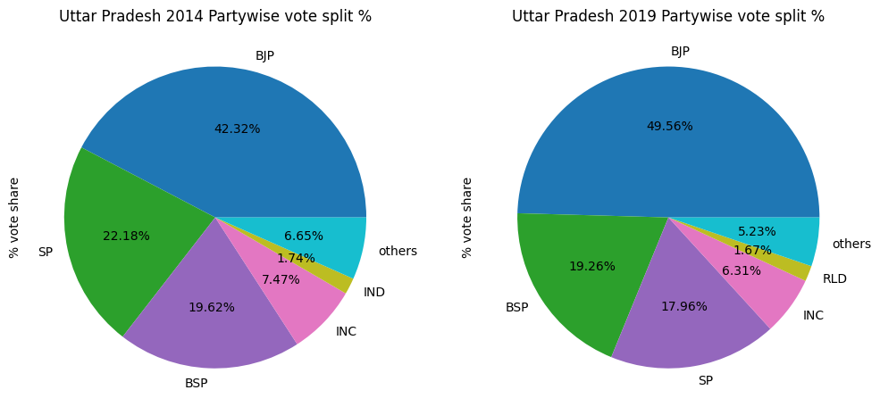
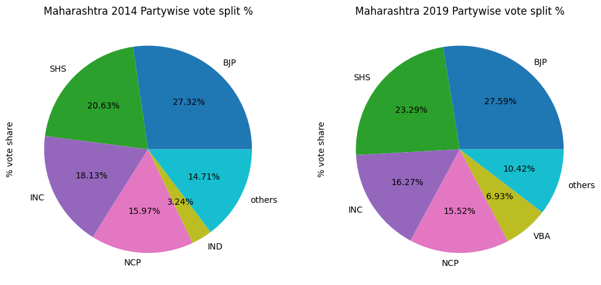

# **Loksabha Elections Data Analysis** for Codebasics Resume Project Challenge #11

## Problem Statement
AtliQ Media is a private media company and they wanted to telecast a show on LokSabha eletions 2024 in India. Unlike others channels they do not want to have a debate on who is going to win this election, they rather wanted to present insights from 2014 and 2019 elections without any bias and discuss less explored themes like voter turnout percentage in India. Peter is a data analyst in the company, and he is handed over this task of generating meaningful insights from data. Since this is a sensitive topic, he seeked help from his manager Tony Sharma who provided the list of primary and secondary questions.

Task:
Imagine yourself as Peter Pandey and perform following tasks.
1. Begin your analysis by referrring to the 'primary_and_secondary_questions.pdf'. You can use any tool of your choice to analyze and answer these questions. More instructions are provided in this docuement.
2. You can use additional data based on your own research to support your recommendations and provide more insights.
3. Be creative with your presentation, audio/video presentatio will have more weightage. You will be presenting these insights to the chief editor Bruce Haryali - he appreciates good storytelling and consice presentation.
--------------------------------------------------------------------------
## Link to [Video Presentation on LinkedIn]()

## Tools used
1. Environment: Jupyter
2. Python packages: Pandas, Matplotlib, Folium, Json
3. For Video presentation and editing: Canva, OBS
--------------------------------------------------------------------------
## Notebook
|Sr No.|Description|
|-|-|
|**1**|[**Data Ingestion, data cleaning & data validation**](#1-data-ingestion-data-cleaning--data-validation)|
|**2**|[**Primary Questions**](#2-primary-questions)|
|2.1|[List top 5/ bottom 5 constituencies of 2014 and 2019 in terms of voter turnout ratio](#q-1-list-top-5-bottom-5-constituencies-of-2014-and-2019-in-terms-of-voter-turnout-ratio)|
|2.2|[List top 5/ bottom 5 states of 2014 and 2019 in terms of voter turnout ratio](#q-2-list-top-5-bottom-5-states-of-2014-and-2019-in-terms-of-voter-turnout-ratio)|
|2.3|[Which constituencies have elected the same party for 2 consecutive elections, rank them by % of votes to that winning party in 2019?](#q-3-which-constituencies-have-elected-the-same-party-for-2-consecutive-elections-rank-them-by--of-votes-to-that-winning-party-in-2019)|
|2.4|[Which constituencies have voted for different parties in two elections (list top 10 based on difference (2019-2014) in winner vote percentage in two elections)?](#q-4-which-constituencies-have-voted-for-different-parties-in-two-elections-list-top-10-based-on-difference-2019-2014-in-winner-vote-percentage-in-two-elections)|
|2.5|[Top 5 candidates based on margin difference with runners in 2014 and 2019](#q-5-top-5-candidates-based-on-margin-difference-with-runners-in-2014-and-2019)|
|2.6|[% split of votes of parties between 2014 vs 2019 at national level](#q-6--split-of-votes-of-parties-between-2014-vs-2019-at-national-level)|
|2.7|[% split of votes of parties between 2014 vs 2019 at state level](#q-7--split-of-votes-of-parties-between-2014-vs-2019-at-state-level)|
|2.8|[List top 5 constituencies for two major national parties where they have gained vote share in 2019 as compared to 2014](#q-8-list-top-5-constituencies-for-two-major-national-parties-where-they-have-gained-vote-share-in-2019-as-compared-to-2014)|
|2.9|[List top 5 constituencies for two major national parties where they have lost vote share in 2019 as compared to 2014](#q-9-list-top-5-constituencies-for-two-major-national-parties-where-they-have-lost-vote-share-in-2019-as-compared-to-2014)|
|2.10|[Which constituency has voted the most for nota?](#q-10-which-constituency-has-voted-the-most-for-nota)|
|2.11|[Which constituencies have elected candidates whose party has less than 10% vote share at state level in 2019?](#q-11-which-constituencies-have-elected-candidates-whose-party-has-less-than-10-vote-share-at-state-level-in-2019)|
|**3**|[**Secondary Questions**](#3-secondary-questions)|
|3.1|[Is there a correlation between postal votes % and voter turnout %?](#q-1-is-there-a-correlation-between-postal-votes--and-voter-turnout-)|
|3.2|[Is there any correlation between GDP of a state and voter turnout %?](#q-2-is-there-any-correlation-between-gdp-of-a-state-and-voter-turnout-)|
|3.3|[Is there any correlation between literacy % of a state and voter turnout %?](#q-3-is-there-any-correlation-between-literacy--of-a-state-and-voter-turnout-)|
|3.4|[Provide 3 recommendations on what the election commission/ government can do to increase the voter turnout %](#q-4-provide-3-recommendations-on-what-the-election-commission-government-can-do-to-increase-the-voter-turnout-)|

```python
# import necessary libraries
import pandas as pd
import matplotlib.pyplot as plt
import json
import folium

# supress warnings
import warnings
warnings.simplefilter(action='ignore', category=FutureWarning)
```

# 1. Data Ingestion, data cleaning & data validation

For this project challenge, 3 datatsets from ECI website have been made available for analysis
- `constituency_wise_results_2014.csv`
- `constituency_wise_results_2019.csv`
- `dim_states_codes.csv`


```python
# import data
df_r14 = pd.read_csv(r"datasets/constituency_wise_results_2014.csv")
df_r19 = pd.read_csv(r"datasets/constituency_wise_results_2019.csv")
states = pd.read_csv(r"datasets/dim_states_codes.csv")
```


```python
# check few rows from 2014 results dataset
df_r14.head(3)
```


<div>
<table border="1" class="dataframe">
  <thead>
    <tr style="text-align: right;">
      <th></th>
      <th>state</th>
      <th>pc_name</th>
      <th>candidate</th>
      <th>sex</th>
      <th>age</th>
      <th>category</th>
      <th>party</th>
      <th>party_symbol</th>
      <th>general_votes</th>
      <th>postal_votes</th>
      <th>total_votes</th>
      <th>total_electors</th>
    </tr>
  </thead>
  <tbody>
    <tr>
      <th>0</th>
      <td>Andhra Pradesh</td>
      <td>Adilabad</td>
      <td>GODAM NAGESH</td>
      <td>M</td>
      <td>49.0</td>
      <td>ST</td>
      <td>TRS</td>
      <td>Car</td>
      <td>425762</td>
      <td>5085</td>
      <td>430847</td>
      <td>1386282</td>
    </tr>
    <tr>
      <th>1</th>
      <td>Andhra Pradesh</td>
      <td>Adilabad</td>
      <td>NARESH</td>
      <td>M</td>
      <td>37.0</td>
      <td>ST</td>
      <td>INC</td>
      <td>Hand</td>
      <td>257994</td>
      <td>1563</td>
      <td>259557</td>
      <td>1386282</td>
    </tr>
    <tr>
      <th>2</th>
      <td>Andhra Pradesh</td>
      <td>Adilabad</td>
      <td>RAMESH RATHOD</td>
      <td>M</td>
      <td>48.0</td>
      <td>ST</td>
      <td>TDP</td>
      <td>Bicycle</td>
      <td>182879</td>
      <td>1319</td>
      <td>184198</td>
      <td>1386282</td>
    </tr>
  </tbody>
</table>
</div>


```python
# check few rows from 2019 results dataset
df_r19.head(3)
```


<div>
<table border="1" class="dataframe">
  <thead>
    <tr style="text-align: right;">
      <th></th>
      <th>state</th>
      <th>pc_name</th>
      <th>candidate</th>
      <th>sex</th>
      <th>age</th>
      <th>category</th>
      <th>party</th>
      <th>party_symbol</th>
      <th>general_votes</th>
      <th>postal_votes</th>
      <th>total_votes</th>
      <th>total_electors</th>
    </tr>
  </thead>
  <tbody>
    <tr>
      <th>0</th>
      <td>Andhra Pradesh</td>
      <td>Aruku</td>
      <td>KISHORE CHANDRA DEO</td>
      <td>MALE</td>
      <td>72.0</td>
      <td>ST</td>
      <td>TDP</td>
      <td>Bicycle</td>
      <td>336163</td>
      <td>1938</td>
      <td>338101</td>
      <td>1451418</td>
    </tr>
    <tr>
      <th>1</th>
      <td>Andhra Pradesh</td>
      <td>Aruku</td>
      <td>Dr. KOSURI KASI VISWANADHA VEERA VENKATA SATYA...</td>
      <td>MALE</td>
      <td>54.0</td>
      <td>ST</td>
      <td>BJP</td>
      <td>Lotus</td>
      <td>17578</td>
      <td>289</td>
      <td>17867</td>
      <td>1451418</td>
    </tr>
    <tr>
      <th>2</th>
      <td>Andhra Pradesh</td>
      <td>Aruku</td>
      <td>GODDETI. MADHAVI</td>
      <td>FEMALE</td>
      <td>26.0</td>
      <td>ST</td>
      <td>YSRCP</td>
      <td>Ceiling Fan</td>
      <td>557561</td>
      <td>4629</td>
      <td>562190</td>
      <td>1451418</td>
    </tr>
  </tbody>
</table>
</div>


```python
# check few rows from dim_states dataset
states.head(3)
```


<div>
<table border="1" class="dataframe">
  <thead>
    <tr style="text-align: right;">
      <th></th>
      <th>state_name</th>
      <th>abbreviation</th>
    </tr>
  </thead>
  <tbody>
    <tr>
      <th>0</th>
      <td>Andaman &amp; Nicobar Islands</td>
      <td>AN</td>
    </tr>
    <tr>
      <th>1</th>
      <td>Andhra Pradesh</td>
      <td>AP</td>
    </tr>
    <tr>
      <th>2</th>
      <td>Arunachal Pradesh</td>
      <td>AR</td>
    </tr>
  </tbody>
</table>
</div>


```python
# check no of unique states in both result datasets
df_r14.state.nunique(), df_r19.state.nunique()
```


    (33, 36)


```python
# which states are missing in 2014 dataset
[state for state in list(df_r19.state.unique()) if state not in list(df_r14.state.unique())]
```


    ['Odisha', 'Chhattisgarh', 'Telangana']


🔍 Observation:
- Data related to constituencies in 'Odisha' and 'Chhattisgarh' is missing in 2014 dataset.

🔑 Note:
- Telangana was bifurcated from AndhraPradesh in 2014.
- Hence, constituencies belonging to Telangana can be mapped using 2019 dataset.


```python
# get the list of constituencies belonging to telangana state from 2019 dataset
pc_telangana = df_r19[df_r19.state == "Telangana"].pc_name.unique()

# map those constituencies to telangana in 2014 dataset
df_r14.state = df_r14.apply(lambda row: row.state.replace(row.state, "Telangana") \
                            if row.pc_name in list(pc_telangana) else row.state,
                            axis=1)

# check pc_names in telangana state from 2014 dataset after mapping
df_r14[df_r14.state == "Telangana"].pc_name.unique()
```


    array(['Adilabad ', 'Peddapalle ', 'Karimnagar ', 'Nizamabad',
           'Zahirabad', 'Medak', 'Malkajgiri', 'Secundrabad', 'Hyderabad',
           'Mahbubnagar', 'Nagarkurnool', 'Nalgonda', 'Bhongir ', 'Warangal',
           'Mahabubabad  ', 'Khammam '], dtype=object)


```python
# check unique constituency names
df_r14.pc_name.unique()
```


    array(['Adilabad ', 'Peddapalle ', 'Karimnagar ', 'Nizamabad',
           'Zahirabad', 'Medak', 'Malkajgiri', 'Secundrabad', 'Hyderabad',
           'CHELVELLA', 'Mahbubnagar', 'Nagarkurnool', 'Nalgonda', 'Bhongir ',
           'Warangal', 'Mahabubabad  ', 'Khammam ', 'Aruku ', 'Srikakulam',
           'Vizianagaram', 'Visakhapatnam', 'Anakapalli', 'Kakinada',
           'Amalapuram ', 'Rajahmundry', 'Narsapuram', 'Eluru ',
           'Machilipatnam ', 'Vijayawada', 'Guntur', 'Narasaraopet',
           'Bapatla ', 'Ongole ', 'Nandyal', 'Kurnool', 'Anantapur',
           'Hindupur', 'Kadapa', 'Nellore', 'Tirupati ', 'Rajampet',
           'Chittoor ', 'ARUNACHAL WEST', 'ARUNACHAL EAST', 'Karimganj ',
           'Silchar', 'Autonomous District', 'Dhubri', 'Kokrajhar', 'Barpeta',
           'Gauhati', 'Mangaldoi', 'Tezpur', 'Nowgong', 'Kaliabor', 'Jorhat',
           'Dibrugarh', 'Lakhimpur', 'Valmiki Nagar', 'Paschim Champaran',
           'Purvi Champaran', 'Sheohar', 'Sitamarhi', 'Madhubani',
           'Jhanjharpur', 'Supaul', 'Araria', 'Kishanganj', 'Katihar',
           'Purnia', 'Madhepura', 'Darbhanga', 'Muzaffarpur', 'Vaishali',
           'Gopalganj (SC)', 'Siwan', 'Maharajganj', 'Saran', 'Hajipur (SC)',
           'Ujiarpur', 'Samastipur (SC)', 'Begusarai', 'Khagaria',
           'Bhagalpur', 'Banka', 'Munger', 'Nalanda', 'Patna Sahib',
           'Pataliputra', 'Arrah', 'Buxar', 'Sasaram (SC)', 'Karakat',
           'Jahanabad', 'Aurangabad', 'Gaya (SC)', 'Nawada', 'Jamui (SC)',
           'North Goa', 'South Goa', 'Kachchh', 'Banaskantha', 'Patan',
           'Mahesana', 'Sabarkantha', 'Gandhinagar', 'Ahmedabad East',
           'Ahmedabad West', 'Surendranagar', 'Rajkot', 'Porbandar',
           'Jamnagar', 'Junagadh', 'Amreli', 'Bhavnagar', 'Anand', 'Kheda',
           'Panchmahal', 'Dahod', 'Vadodara', 'Chhota Udaipur', 'Bharuch',
           'Bardoli', 'Surat', 'Navsari', 'Valsad', 'Ambala', 'Kurukshetra',
           'Sirsa', 'Hisar', 'Karnal', 'Sonipat', 'Rohtak',
           'Bhiwani-Mahendragarh', 'Gurgaon', 'Faridabad', 'Kangra', 'Mandi',
           'Hamirpur', 'Shimla', 'Baramulla', 'Srinagar', 'Anantnag',
           'Ladakh', 'Udhampur', 'Jammu', 'Chikkodi', 'Belgaum', 'Bagalkot',
           'Bijapur', 'Gulbarga', 'Raichur', 'Bidar', 'Koppal', 'Bellary',
           'Haveri', 'Dharwad', 'Uttara Kannada', 'Davanagere', 'Shimoga',
           'Udupi Chikmagalur', 'Hassan', 'Dakshina Kannada', 'Chitradurga',
           'Tumkur', 'Mandya', 'Mysore', 'Chamarajanagar', 'Bangalore Rural',
           'Bangalore North', 'Bangalore central', 'Bangalore South',
           'Chikkballapur', 'Kolar', 'Kasaragod', 'Kannur', 'Vadakara',
           'Wayanad', 'Kozhikode', 'Malappuram', 'Ponnani', 'Palakkad',
           'Alathur ', 'Thrissur', 'Chalakudy', 'Ernakulam', 'Idukki',
           'Kottayam', 'Alappuzha', 'Mavelikkara ', 'Pathanamthitta',
           'Kollam', 'Attingal', 'Thiruvananthapuram', 'MORENA', 'BHIND',
           'GWALIOR', 'GUNA', 'SAGAR', 'TIKAMGARH', 'DAMOH', 'KHAJURAHO',
           'SATNA', 'REWA', 'SIDHI', 'SHAHDOL', 'JABALPUR', 'MANDLA',
           'BALAGHAT', 'CHHINDWARA', 'HOSHANGABAD', 'VIDISHA', 'BHOPAL',
           'RAJGARH', 'DEWAS', 'UJJAIN', 'MANDSOUR', 'RATLAM', 'DHAR',
           'INDORE', 'KHARGONE', 'KHANDWA', 'BETUL', 'Nandurbar ', 'Dhule',
           'Jalgaon', 'Raver', 'Buldhana', 'Akola', 'Amravati ', 'Wardha',
           'Ramtek ', 'Nagpur ', 'Bhandara - gondiya', 'Gadchiroli-Chimur',
           'Chandrapur', 'Yavatmal-Washim', 'Hingoli ', 'Nanded', 'Parbhani',
           'Jalna', 'Dindori ', 'Nashik', 'Palghar ', 'Bhiwandi', 'Kalyan',
           'Thane', 'Mumbai North', 'Mumbai North West', 'Mumbai North East',
           'Mumbai North central', 'Mumbai South central', 'Mumbai   South',
           'Raigad', 'Maval', 'Pune', 'Baramati', 'Shirur', 'Ahmadnagar ',
           'Shirdi', 'Beed', 'Osmanabad', 'Latur ', 'Solapur ', 'Madha',
           'Sangli', 'Satara', 'Ratnagiri - sindhudurg', 'Kolhapur',
           'Hatkanangle', 'Inner manipur', 'Outer manipur', 'Shillong',
           'Tura ', 'MIZORAM', 'Nagaland', 'Gurdaspur', 'Amritsar',
           'Khadoor Sahib', 'Jalandhar', 'Hoshiarpur', 'Anandpur Sahib',
           'Ludhiana', 'Fatehgarh Sahib', 'Faridkot', 'Firozpur', 'Bathinda',
           'Sangrur', 'Patiala', 'Ganganagar', 'Bikaner', 'Churu',
           'Jhunjhunu', 'Sikar', 'Jaipur Rural', 'Jaipur', 'Alwar',
           'BHARATPUR', 'KARAULI-DHOLPUR', 'Dausa', 'TONK-SAWAI MADHOPUR',
           'Ajmer', 'Nagaur', 'Pali', 'Jodhpur', 'Barmer', 'Jalore',
           'Udaipur', 'Banswara', 'Chittorgarh', 'Rajsamand', 'Bhilwara',
           'Kota', 'JHALAWAR-BARAN', 'Sikkim', 'Thiruvallur ',
           'Chennai North', 'Chennai South', 'Chennai central',
           'Sriperumbudur', 'Kancheepuram ', 'Arakkonam', 'Vellore',
           'Krishnagiri', 'Dharmapuri', 'Tiruvannamalai', 'Arani',
           'Viluppuram', 'Kallakurichi', 'Salem', 'Namakkal', 'Erode',
           'Tiruppur', 'Nilgiris ', 'Coimbatore', 'Pollachi', 'Dindigul',
           'Karur', 'Tiruchirappalli', 'Perambalur', 'Cuddalore ',
           'Chidambaram ', 'Mayiladuthurai', 'Nagapattinam ', 'Thanjavur',
           'Sivaganga', 'Madurai', 'Theni ', 'Virudhunagar', 'Ramanathapuram',
           'Thoothukkudi', 'Tenkasi ', 'Tirunelveli', 'Kanniyakumari',
           'Tripura West', 'Tripura East', 'Saharanpur', 'Kairana',
           'Muzaffarnagar', 'Bijnor', 'Nagina', 'Moradabad', 'Rampur',
           'Sambhal', 'Amroha', 'Meerut', 'Baghpat', 'Ghaziabad',
           'Gautam Buddha Nagar', 'Bulandshahr', 'Aligarh', 'Hathras',
           'Mathura', 'Agra', 'Fatehpur Sikri', 'Firozabad', 'Mainpuri',
           'Etah', 'Badaun', 'Aonla', 'Bareilly', 'Pilibhit', 'Shahjahanpur',
           'Kheri', 'Dhaurahra', 'Sitapur', 'Hardoi', 'Misrikh', 'Unnao',
           'Mohanlalganj', 'Lucknow', 'Rae Bareli', 'Amethi', 'Sultanpur',
           'Pratapgarh', 'Farrukhabad', 'Etawah', 'Kannauj', 'Kanpur',
           'Akbarpur', 'Jalaun', 'Jhansi', 'Banda', 'Fatehpur', 'Kaushambi',
           'Phulpur', 'Allahabad', 'Barabanki', 'Faizabad', 'Ambedkar Nagar',
           'Bahraich', 'Kaiserganj', 'Shrawasti', 'Gonda', 'Domariyaganj',
           'Basti', 'Sant Kabir Nagar', 'Gorakhpur', 'Kushi Nagar', 'Deoria',
           'Bansgaon', 'Lalganj', 'Azamgarh', 'Ghosi', 'Salempur', 'Ballia',
           'Jaunpur', 'Machhlishahr', 'Ghazipur', 'Chandauli', 'Varanasi',
           'Bhadohi', 'Mirzapur', 'Robertsganj', 'Cooch behar', 'Alipurduars',
           'Jalpaiguri', 'Darjeeling', 'Raiganj', 'Balurghat',
           'Maldaha Uttar', 'Maldaha Dakshin', 'Jangipur', 'Baharampur',
           'Murshidabad', 'Krishnanagar', 'Ranaghat', 'Bangaon',
           'Barrackpore', 'Dum dum', 'Barasat', 'Basirhat', 'Joynagar',
           'Mathurapur', 'Diamond harbour', 'Jadavpur', 'Kolkata Dakshin',
           'Kolkata Uttar', 'Howrah', 'Uluberia', 'Srerampur', 'Hooghly',
           'Arambagh', 'Tamluk', 'Kanthi', 'Ghatal', 'Jhargram', 'Medinipur',
           'Purulia', 'Bankura', 'Bishnupur', 'Bardhaman Purba',
           'Burdwan - durgapur', 'Asansol', 'Bolpur', 'Birbhum', 'Rajmahal',
           'Dumka', 'Godda', 'Chatra', 'Kodarma', 'Giridih', 'Dhanbad',
           'Ranchi', 'Jamshedpur', 'Singhbhum', 'Khunti', 'Lohardaga',
           'Palamau', 'Hazaribagh', 'Tehri Garhwal', 'Garhwal', 'Almora',
           'Nainital-udhamsingh Nagar', 'Hardwar',
           'Andaman & Nicobar Islands', 'CHANDIGARH', 'Dadar & Nagar Haveli',
           'Daman & diu', 'CHANDNI CHOWK                 ',
           'NORTH EAST DELHI              ', 'EAST DELHI                    ',
           'NEW DELHI                     ', 'NORTH WEST DELHI              ',
           'WEST DELHI                    ', 'SOUTH DELHI                   ',
           'Lakshadweep', 'Puducherry'], dtype=object)


🔍 Obesrvations:
1. There are extra trailing spaces
2. Few reserved constituencies have (SC) mentioned in their name which is not required for our analysis
3. Few pc_names are in title case while rest are in capital case.
4. There is '-' in between few pc_names.


```python
# create a function to clean above mentioned data errors
def clean_data_errors(pc_name):
    """Cleans data errors in constituency names like
        1. Converts to lowercase
        2. Removes "(SC)" keyword which is not required for our analysis
        3. Replaces hyphen "-" with space
        4. Remove extra trailing spaces.

    Args:
        pc_name: [str] constituency name

    Returns:
        [str] cleaned pc_name
    """
    # convert to lower case
    pc_name = pc_name.lower()

    # remove '(sc)' from pc_name
    pc_name = pc_name.replace("(sc)", "")

    # replace '-' with space
    pc_name = pc_name.replace(" - ", " ")
    pc_name = pc_name.replace("-", " ")

    # remove extra trailing spaces
    pc_name = pc_name.strip()

    return pc_name
```


```python
# pc_name data errors cleaning
df_r14.pc_name = df_r14.pc_name.apply(lambda x: clean_data_errors(x))
df_r19.pc_name = df_r19.pc_name.apply(lambda x: clean_data_errors(x))
```


```python
# Number of unique constituencies
df_r14.pc_name.nunique(), df_r19.pc_name.nunique()
```


    (508, 540)


🔍 Obesrvations:
- Since we don't have data related to constituencies in 'Odisha' and 'Chhattisgarh', we can observe less number of constituencies in 2014 dataset.


```python
# verify if the pc_names in 2014 dataset are present in 2019 dataset
[i for i in df_r14.pc_name.unique() if i not in df_r19.pc_name.unique()]
```


    ['chelvella', 'joynagar', 'burdwan durgapur', 'dadar & nagar haveli']


🔍 Obesrvations:
- These 4 pc_names have spelling mistakes
- Corrections required as
```
{
"chelvella": "chevella",
"joynagar": "jaynagar",
"burdwan durgapur": "bardhaman durgapur",
"dadar & nagar haveli": "dadra and nagar haveli"
}
```


```python
# replace incorrect pc_names with correct spellings
correct_pc_names = {
                    "chelvella": "chevella",
                    "joynagar": "jaynagar",
                    "burdwan durgapur": "bardhaman durgapur",
                    "dadar & nagar haveli": "dadra and nagar haveli"
                    }
df_r14.pc_name.replace(correct_pc_names, inplace=True)
```


```python
# statistical info from numerical columns
df_r14.describe()
```


<div>
<table border="1" class="dataframe">
  <thead>
    <tr style="text-align: right;">
      <th></th>
      <th>age</th>
      <th>general_votes</th>
      <th>postal_votes</th>
      <th>total_votes</th>
      <th>total_electors</th>
    </tr>
  </thead>
  <tbody>
    <tr>
      <th>count</th>
      <td>7845.000000</td>
      <td>8355.000000</td>
      <td>8355.000000</td>
      <td>8355.000000</td>
      <td>8.355000e+03</td>
    </tr>
    <tr>
      <th>mean</th>
      <td>47.135883</td>
      <td>62132.985398</td>
      <td>107.407660</td>
      <td>62240.393058</td>
      <td>1.574132e+06</td>
    </tr>
    <tr>
      <th>std</th>
      <td>11.902487</td>
      <td>140261.650370</td>
      <td>436.090305</td>
      <td>140535.827087</td>
      <td>2.711797e+05</td>
    </tr>
    <tr>
      <th>min</th>
      <td>25.000000</td>
      <td>105.000000</td>
      <td>0.000000</td>
      <td>105.000000</td>
      <td>4.992200e+04</td>
    </tr>
    <tr>
      <th>25%</th>
      <td>38.000000</td>
      <td>1708.000000</td>
      <td>0.000000</td>
      <td>1708.500000</td>
      <td>1.446478e+06</td>
    </tr>
    <tr>
      <th>50%</th>
      <td>46.000000</td>
      <td>4350.000000</td>
      <td>1.000000</td>
      <td>4354.000000</td>
      <td>1.578125e+06</td>
    </tr>
    <tr>
      <th>75%</th>
      <td>56.000000</td>
      <td>14881.000000</td>
      <td>13.000000</td>
      <td>14886.000000</td>
      <td>1.718414e+06</td>
    </tr>
    <tr>
      <th>max</th>
      <td>93.000000</td>
      <td>859973.000000</td>
      <td>6792.000000</td>
      <td>863358.000000</td>
      <td>3.183083e+06</td>
    </tr>
  </tbody>
</table>
</div>


```python
# statistical info from numerical columns
df_r19.describe()
```


<div>

<table border="1" class="dataframe">
  <thead>
    <tr style="text-align: right;">
      <th></th>
      <th>age</th>
      <th>general_votes</th>
      <th>postal_votes</th>
      <th>total_votes</th>
      <th>total_electors</th>
    </tr>
  </thead>
  <tbody>
    <tr>
      <th>count</th>
      <td>8054.000000</td>
      <td>8.597000e+03</td>
      <td>8597.000000</td>
      <td>8.597000e+03</td>
      <td>8.597000e+03</td>
    </tr>
    <tr>
      <th>mean</th>
      <td>47.065185</td>
      <td>7.117290e+04</td>
      <td>267.469699</td>
      <td>7.144037e+04</td>
      <td>1.705181e+06</td>
    </tr>
    <tr>
      <th>std</th>
      <td>12.140434</td>
      <td>1.735669e+05</td>
      <td>929.319680</td>
      <td>1.742342e+05</td>
      <td>2.969405e+05</td>
    </tr>
    <tr>
      <th>min</th>
      <td>24.000000</td>
      <td>8.400000e+01</td>
      <td>0.000000</td>
      <td>8.400000e+01</td>
      <td>5.518900e+04</td>
    </tr>
    <tr>
      <th>25%</th>
      <td>38.000000</td>
      <td>1.315000e+03</td>
      <td>1.000000</td>
      <td>1.317000e+03</td>
      <td>1.553385e+06</td>
    </tr>
    <tr>
      <th>50%</th>
      <td>46.000000</td>
      <td>3.341000e+03</td>
      <td>4.000000</td>
      <td>3.350000e+03</td>
      <td>1.703279e+06</td>
    </tr>
    <tr>
      <th>75%</th>
      <td>56.000000</td>
      <td>1.239100e+04</td>
      <td>36.000000</td>
      <td>1.242100e+04</td>
      <td>1.856791e+06</td>
    </tr>
    <tr>
      <th>max</th>
      <td>90.000000</td>
      <td>1.066824e+06</td>
      <td>19367.000000</td>
      <td>1.068569e+06</td>
      <td>3.150313e+06</td>
    </tr>
  </tbody>
</table>
</div>


```python
# check the rows with age less than 25
df_r19[df_r19.age < 25]
```


<div>

<table border="1" class="dataframe">
  <thead>
    <tr style="text-align: right;">
      <th></th>
      <th>state</th>
      <th>pc_name</th>
      <th>candidate</th>
      <th>sex</th>
      <th>age</th>
      <th>category</th>
      <th>party</th>
      <th>party_symbol</th>
      <th>general_votes</th>
      <th>postal_votes</th>
      <th>total_votes</th>
      <th>total_electors</th>
    </tr>
  </thead>
  <tbody>
    <tr>
      <th>5750</th>
      <td>Tamil Nadu</td>
      <td>tenkasi</td>
      <td>PONNUTHAI.G</td>
      <td>FEMALE</td>
      <td>24.0</td>
      <td>SC</td>
      <td>IND</td>
      <td>Television</td>
      <td>2424</td>
      <td>3</td>
      <td>2427</td>
      <td>1492317</td>
    </tr>
  </tbody>
</table>
</div>


🔍 Obesrvations:
- As per constitutional guidelines minimum age of MP applicant should not be less than 25 years as on the date of scrutiny of nomination papers. However, in 2019 election result dataset we find one candidate having age 24 years.


```python
# For our further analysis we will need a column of voter_turnout_ratio
# Constituency-wise voter turnout ratio
df_r14_grouped = df_r14.groupby(["state", "pc_name"]).agg({"total_votes": 'sum', "total_electors": 'max'}).reset_index()
df_r14_grouped["turnout_ratio"] = round(df_r14_grouped.total_votes*100/df_r14_grouped.total_electors, 2)

df_r19_grouped = df_r19.groupby(["state", "pc_name"]).agg({"total_votes": 'sum', "total_electors": 'max'}).reset_index()
df_r19_grouped["turnout_ratio"] = round(df_r19_grouped.total_votes*100/df_r19_grouped.total_electors, 2)

# State-wise voter turnout ratio
df_r14_grouped_states = df_r14_grouped.groupby(["state"]).agg({"total_votes": 'sum', "total_electors": 'sum'}).reset_index()
df_r14_grouped_states["turnout_ratio"] = round(df_r14_grouped_states.total_votes*100/df_r14_grouped_states.total_electors, 2)

df_r19_grouped_states = df_r19_grouped.groupby(["state"]).agg({"total_votes": 'sum', "total_electors": 'sum'}).reset_index()
df_r19_grouped_states["turnout_ratio"] = round(df_r19_grouped_states.total_votes*100/df_r19_grouped_states.total_electors, 2)
```

```python
# Overall voter turnout_ratio
print("Overall Turnout ratio")
print("\t2014 Loksabha Elections:" ,\
        round(df_r14_grouped.total_votes.sum()*100/df_r14_grouped.total_electors.sum(),2),"%")

print("\t2019 Loksabha Elections:" ,\
        round(df_r19_grouped.total_votes.sum()*100/df_r19_grouped.total_electors.sum(),2),"%")
```

    Overall Turnout ratio
    	2014 Loksabha Elections: 66.06 %
    	2019 Loksabha Elections: 67.35 %
    

**Note:** Here, overall turnout ratio in 2014 elections is not reliable because data for 2 states in missing


```python
# No of states/UTs which have lower turnout ratio than overall turnout ratio in 2019
df_r19_grouped_states[df_r19_grouped_states.turnout_ratio < 67.35].shape[0]
```


    13


```python
# list those 13 states/UTs which have lower turnout ratio than overall turnout ratio in 2019
df_r19_grouped_states[df_r19_grouped_states.turnout_ratio < 67.35].sort_values('turnout_ratio')
```


<div>
<table border="1" class="dataframe">
  <thead>
    <tr style="text-align: right;">
      <th></th>
      <th>state</th>
      <th>total_votes</th>
      <th>total_electors</th>
      <th>turnout_ratio</th>
    </tr>
  </thead>
  <tbody>
    <tr>
      <th>13</th>
      <td>Jammu &amp; Kashmir</td>
      <td>3552622</td>
      <td>7922538</td>
      <td>44.84</td>
    </tr>
    <tr>
      <th>4</th>
      <td>Bihar</td>
      <td>40806661</td>
      <td>71216290</td>
      <td>57.30</td>
    </tr>
    <tr>
      <th>33</th>
      <td>Uttar Pradesh</td>
      <td>86481398</td>
      <td>146134603</td>
      <td>59.18</td>
    </tr>
    <tr>
      <th>23</th>
      <td>NCT OF Delhi</td>
      <td>8679012</td>
      <td>14327649</td>
      <td>60.58</td>
    </tr>
    <tr>
      <th>19</th>
      <td>Maharashtra</td>
      <td>54054245</td>
      <td>88676946</td>
      <td>60.96</td>
    </tr>
    <tr>
      <th>34</th>
      <td>Uttarakhand</td>
      <td>4842925</td>
      <td>7856318</td>
      <td>61.64</td>
    </tr>
    <tr>
      <th>31</th>
      <td>Telangana</td>
      <td>18642895</td>
      <td>29708615</td>
      <td>62.75</td>
    </tr>
    <tr>
      <th>22</th>
      <td>Mizoram</td>
      <td>499621</td>
      <td>792464</td>
      <td>63.05</td>
    </tr>
    <tr>
      <th>10</th>
      <td>Gujarat</td>
      <td>29081964</td>
      <td>45152373</td>
      <td>64.41</td>
    </tr>
    <tr>
      <th>0</th>
      <td>Andaman &amp; Nicobar Islands</td>
      <td>207296</td>
      <td>318471</td>
      <td>65.09</td>
    </tr>
    <tr>
      <th>27</th>
      <td>Punjab</td>
      <td>13765432</td>
      <td>20892673</td>
      <td>65.89</td>
    </tr>
    <tr>
      <th>28</th>
      <td>Rajasthan</td>
      <td>32441064</td>
      <td>48955813</td>
      <td>66.27</td>
    </tr>
    <tr>
      <th>14</th>
      <td>Jharkhand</td>
      <td>14961958</td>
      <td>22404856</td>
      <td>66.78</td>
    </tr>
  </tbody>
</table>
</div>


# 2. Primary Questions

### Q 1. List top 5/ bottom 5 constituencies of 2014 and 2019 in terms of voter turnout ratio


```python
# Top 5 constituencies of 2014
df_r14_grouped.sort_values("turnout_ratio", ascending=False).reset_index(drop=True).head()
```


<div>

<table border="1" class="dataframe">
  <thead>
    <tr style="text-align: right;">
      <th></th>
      <th>state</th>
      <th>pc_name</th>
      <th>total_votes</th>
      <th>total_electors</th>
      <th>turnout_ratio</th>
    </tr>
  </thead>
  <tbody>
    <tr>
      <th>0</th>
      <td>Assam</td>
      <td>dhubri</td>
      <td>1369624</td>
      <td>1550166</td>
      <td>88.35</td>
    </tr>
    <tr>
      <th>1</th>
      <td>Nagaland</td>
      <td>nagaland</td>
      <td>1038910</td>
      <td>1182972</td>
      <td>87.82</td>
    </tr>
    <tr>
      <th>2</th>
      <td>West Bengal</td>
      <td>tamluk</td>
      <td>1337684</td>
      <td>1527273</td>
      <td>87.59</td>
    </tr>
    <tr>
      <th>3</th>
      <td>West Bengal</td>
      <td>bishnupur</td>
      <td>1272070</td>
      <td>1466921</td>
      <td>86.72</td>
    </tr>
    <tr>
      <th>4</th>
      <td>Lakshadweep</td>
      <td>lakshadweep</td>
      <td>43239</td>
      <td>49922</td>
      <td>86.61</td>
    </tr>
  </tbody>
</table>
</div>


```python
# Bottom 5 constituencies of 2014
df_r14_grouped.sort_values("turnout_ratio", ascending=True).reset_index(drop=True).head()
```


<div>
<table border="1" class="dataframe">
  <thead>
    <tr style="text-align: right;">
      <th></th>
      <th>state</th>
      <th>pc_name</th>
      <th>total_votes</th>
      <th>total_electors</th>
      <th>turnout_ratio</th>
    </tr>
  </thead>
  <tbody>
    <tr>
      <th>0</th>
      <td>Jammu &amp; Kashmir</td>
      <td>srinagar</td>
      <td>312212</td>
      <td>1207230</td>
      <td>25.86</td>
    </tr>
    <tr>
      <th>1</th>
      <td>Jammu &amp; Kashmir</td>
      <td>anantnag</td>
      <td>375279</td>
      <td>1301143</td>
      <td>28.84</td>
    </tr>
    <tr>
      <th>2</th>
      <td>Jammu &amp; Kashmir</td>
      <td>baramulla</td>
      <td>465992</td>
      <td>1190766</td>
      <td>39.13</td>
    </tr>
    <tr>
      <th>3</th>
      <td>Maharashtra</td>
      <td>kalyan</td>
      <td>824196</td>
      <td>1922034</td>
      <td>42.88</td>
    </tr>
    <tr>
      <th>4</th>
      <td>Bihar</td>
      <td>patna sahib</td>
      <td>882262</td>
      <td>1946249</td>
      <td>45.33</td>
    </tr>
  </tbody>
</table>
</div>


```python
# Top 5 constituencies of 2019
df_r19_grouped.sort_values("turnout_ratio", ascending=False).reset_index(drop=True).head()
```


<div>
<table border="1" class="dataframe">
  <thead>
    <tr style="text-align: right;">
      <th></th>
      <th>state</th>
      <th>pc_name</th>
      <th>total_votes</th>
      <th>total_electors</th>
      <th>turnout_ratio</th>
    </tr>
  </thead>
  <tbody>
    <tr>
      <th>0</th>
      <td>Assam</td>
      <td>dhubri</td>
      <td>1685005</td>
      <td>1858566</td>
      <td>90.66</td>
    </tr>
    <tr>
      <th>1</th>
      <td>West Bengal</td>
      <td>bishnupur</td>
      <td>1420648</td>
      <td>1627199</td>
      <td>87.31</td>
    </tr>
    <tr>
      <th>2</th>
      <td>Assam</td>
      <td>barpeta</td>
      <td>1458549</td>
      <td>1685149</td>
      <td>86.55</td>
    </tr>
    <tr>
      <th>3</th>
      <td>West Bengal</td>
      <td>jalpaiguri</td>
      <td>1500922</td>
      <td>1735464</td>
      <td>86.49</td>
    </tr>
    <tr>
      <th>4</th>
      <td>Arunachal Pradesh</td>
      <td>arunachal east</td>
      <td>293781</td>
      <td>339788</td>
      <td>86.46</td>
    </tr>
  </tbody>
</table>
</div>


```python
# Bottom 5 constituencies of 2019
df_r19_grouped.sort_values("turnout_ratio", ascending=True).reset_index(drop=True).head()
```


<div>
<table border="1" class="dataframe">
  <thead>
    <tr style="text-align: right;">
      <th></th>
      <th>state</th>
      <th>pc_name</th>
      <th>total_votes</th>
      <th>total_electors</th>
      <th>turnout_ratio</th>
    </tr>
  </thead>
  <tbody>
    <tr>
      <th>0</th>
      <td>Jammu &amp; Kashmir</td>
      <td>anantnag</td>
      <td>124896</td>
      <td>1397779</td>
      <td>8.94</td>
    </tr>
    <tr>
      <th>1</th>
      <td>Jammu &amp; Kashmir</td>
      <td>srinagar</td>
      <td>186832</td>
      <td>1294671</td>
      <td>14.43</td>
    </tr>
    <tr>
      <th>2</th>
      <td>Jammu &amp; Kashmir</td>
      <td>baramulla</td>
      <td>455550</td>
      <td>1317738</td>
      <td>34.57</td>
    </tr>
    <tr>
      <th>3</th>
      <td>Telangana</td>
      <td>hyderabad</td>
      <td>877872</td>
      <td>1957931</td>
      <td>44.84</td>
    </tr>
    <tr>
      <th>4</th>
      <td>Maharashtra</td>
      <td>kalyan</td>
      <td>890313</td>
      <td>1965676</td>
      <td>45.29</td>
    </tr>
  </tbody>
</table>
</div>


🔍 Obesrvations:
- We observe that constituencies in North-Estern region of India show maximum voter turnout ratio
- While, constituencies in Jammu & Kashmir show  lowest turnout ratio.

### Q 2. List top 5/ bottom 5 states of 2014 and 2019 in terms of voter turnout ratio


```python
# top 5 states 2014
df_r14_grouped_states.sort_values("turnout_ratio", ascending=False).reset_index(drop=True).head()
```


<div>
<table border="1" class="dataframe">
  <thead>
    <tr style="text-align: right;">
      <th></th>
      <th>state</th>
      <th>total_votes</th>
      <th>total_electors</th>
      <th>turnout_ratio</th>
    </tr>
  </thead>
  <tbody>
    <tr>
      <th>0</th>
      <td>Nagaland</td>
      <td>1038910</td>
      <td>1182972</td>
      <td>87.82</td>
    </tr>
    <tr>
      <th>1</th>
      <td>Lakshadweep</td>
      <td>43239</td>
      <td>49922</td>
      <td>86.61</td>
    </tr>
    <tr>
      <th>2</th>
      <td>Tripura</td>
      <td>2023829</td>
      <td>2388822</td>
      <td>84.72</td>
    </tr>
    <tr>
      <th>3</th>
      <td>Dadra &amp; Nagar Haveli</td>
      <td>165286</td>
      <td>196597</td>
      <td>84.07</td>
    </tr>
    <tr>
      <th>4</th>
      <td>Sikkim</td>
      <td>308967</td>
      <td>370770</td>
      <td>83.33</td>
    </tr>
  </tbody>
</table>
</div>


```python
# bottom 5 states 2014
df_r14_grouped_states.sort_values("turnout_ratio", ascending=True).reset_index(drop=True).head()
```


<div>
<table border="1" class="dataframe">
  <thead>
    <tr style="text-align: right;">
      <th></th>
      <th>state</th>
      <th>total_votes</th>
      <th>total_electors</th>
      <th>turnout_ratio</th>
    </tr>
  </thead>
  <tbody>
    <tr>
      <th>0</th>
      <td>Jammu &amp; Kashmir</td>
      <td>3566863</td>
      <td>7183129</td>
      <td>49.66</td>
    </tr>
    <tr>
      <th>1</th>
      <td>Bihar</td>
      <td>35885332</td>
      <td>63800160</td>
      <td>56.25</td>
    </tr>
    <tr>
      <th>2</th>
      <td>Uttar Pradesh</td>
      <td>81093120</td>
      <td>138810557</td>
      <td>58.42</td>
    </tr>
    <tr>
      <th>3</th>
      <td>Maharashtra</td>
      <td>48717419</td>
      <td>80798823</td>
      <td>60.29</td>
    </tr>
    <tr>
      <th>4</th>
      <td>Madhya Pradesh</td>
      <td>29639807</td>
      <td>48121301</td>
      <td>61.59</td>
    </tr>
  </tbody>
</table>
</div>


```python
# top 5 states 2019
df_r19_grouped_states.sort_values("turnout_ratio", ascending=False).reset_index(drop=True).head()
```


<div>
<table border="1" class="dataframe">
  <thead>
    <tr style="text-align: right;">
      <th></th>
      <th>state</th>
      <th>total_votes</th>
      <th>total_electors</th>
      <th>turnout_ratio</th>
    </tr>
  </thead>
  <tbody>
    <tr>
      <th>0</th>
      <td>Lakshadweep</td>
      <td>47009</td>
      <td>55189</td>
      <td>85.18</td>
    </tr>
    <tr>
      <th>1</th>
      <td>Nagaland</td>
      <td>1006357</td>
      <td>1213777</td>
      <td>82.91</td>
    </tr>
    <tr>
      <th>2</th>
      <td>Manipur</td>
      <td>1617330</td>
      <td>1959563</td>
      <td>82.54</td>
    </tr>
    <tr>
      <th>3</th>
      <td>Tripura</td>
      <td>2153172</td>
      <td>2614718</td>
      <td>82.35</td>
    </tr>
    <tr>
      <th>4</th>
      <td>West Bengal</td>
      <td>57206976</td>
      <td>70001284</td>
      <td>81.72</td>
    </tr>
  </tbody>
</table>
</div>


```python
# bottom 5 states 2019
df_r19_grouped_states.sort_values("turnout_ratio", ascending=True).reset_index(drop=True).head()
```


<div>
<table border="1" class="dataframe">
  <thead>
    <tr style="text-align: right;">
      <th></th>
      <th>state</th>
      <th>total_votes</th>
      <th>total_electors</th>
      <th>turnout_ratio</th>
    </tr>
  </thead>
  <tbody>
    <tr>
      <th>0</th>
      <td>Jammu &amp; Kashmir</td>
      <td>3552622</td>
      <td>7922538</td>
      <td>44.84</td>
    </tr>
    <tr>
      <th>1</th>
      <td>Bihar</td>
      <td>40806661</td>
      <td>71216290</td>
      <td>57.30</td>
    </tr>
    <tr>
      <th>2</th>
      <td>Uttar Pradesh</td>
      <td>86481398</td>
      <td>146134603</td>
      <td>59.18</td>
    </tr>
    <tr>
      <th>3</th>
      <td>NCT OF Delhi</td>
      <td>8679012</td>
      <td>14327649</td>
      <td>60.58</td>
    </tr>
    <tr>
      <th>4</th>
      <td>Maharashtra</td>
      <td>54054245</td>
      <td>88676946</td>
      <td>60.96</td>
    </tr>
  </tbody>
</table>
</div>


🔍 Obesrvations:
- As like constituencies, North-estern states having overall higher turnout ratio.
- We can also roughly conclude that states/UTs having thin population density have higher turnout ratio and on the other hand densely populated states/UTs have lower turnout ratio across India.


```python
# Lets visualize Voter Turnout ratio over map of India for 2019 data
with open('in.json', encoding="utf8") as file:
    geojsonData = json.load(file)

for i in geojsonData['features']:
    if(i['properties']['name']=='Orissa'):
        i['properties']['name']='Odisha'
    if(i['properties']['name']=='Andaman and Nicobar'):
        i['properties']['name']='Andaman & Nicobar Islands'
    if(i['properties']['name']=='Delhi'):
        i['properties']['name']='NCT OF Delhi'
    if(i['properties']['name']=='Jammu and Kashmir'):
        i['properties']['name']='Jammu & Kashmir'
    if(i['properties']['name']=='Ladakh'):
        i['properties']['name']='Jammu & Kashmir'
    if(i['properties']['name']=='Dādra and Nagar Haveli and Damān and Diu'):
        i['properties']['name']='Dadra & Nagar Haveli'
    if(i['properties']['name']=='Uttaranchal'):
        i['properties']['name']='Uttarakhand'
        
for i in geojsonData['features']:
    i['id'] = i['properties']['name']
    
map_choropleth = folium.Map(location = [23,81], zoom_start = 4.5)

folium.Choropleth(geo_data=geojsonData,
                 data=df_r19_grouped_states,
                 name='CHOROPLETH',
                 key_on='feature.id',
                 columns = ['state', 'turnout_ratio'],
                 fill_color='viridis',
                 fill_opacity=0.75,
                 line_opacity=0.9,
                 legend_name='turnout_ratio',
                 highlight=True).add_to(map_choropleth)

folium.LayerControl().add_to(map_choropleth)
display(map_choropleth)
```


### Q 3. Which constituencies have elected the same party for 2 consecutive elections, rank them by % of votes to that winning party in 2019


```python
# Step 1: Get the winning parties for each election year
winning_2014 = df_r14.loc[df_r14.groupby('pc_name')['total_votes'].idxmax()]
winning_2014 = winning_2014[['pc_name', 'party', 'total_votes']].rename(columns={'party': 'party_2014', 'total_votes': 'votes_2014'})

winning_2019 = df_r19.loc[df_r19.groupby('pc_name')['total_votes'].idxmax()]
winning_2019 = winning_2019[['pc_name', 'party', 'total_votes']].rename(columns={'party': 'party_2019', 'total_votes': 'votes_2019'})

# Step 2: finding total_votes per constituency
votes_2014 = df_r14.groupby("pc_name").total_votes.sum().rename("pc_total_votes_2014")
winning_2014 = winning_2014.merge(votes_2014, left_on="pc_name", right_on=votes_2014.index)
winning_2014['winner % votes 2014'] = round((winning_2014.votes_2014*100)/winning_2014.pc_total_votes_2014 , 2)

votes_2019 = df_r19.groupby("pc_name").total_votes.sum().rename("pc_total_votes_2019")
winning_2019 = winning_2019.merge(votes_2019, left_on="pc_name", right_on=votes_2019.index)
winning_2019['winner % votes 2019'] = round((winning_2019.votes_2019*100)/winning_2019.pc_total_votes_2019 , 2)

# Step 3: Merge the two DataFrames on 'constituency'
merged = pd.merge(winning_2014, winning_2019, on='pc_name')

# Step 4: Filter to keep only constituencies where the same party won in both elections
same_pc = merged[merged['party_2014'] == merged['party_2019']]
same_pc[["pc_name", "party_2014", "party_2019", "winner % votes 2019"]].sort_values("winner % votes 2019", ascending=False)
```


<div>
<table border="1" class="dataframe">
  <thead>
    <tr style="text-align: right;">
      <th></th>
      <th>pc_name</th>
      <th>party_2014</th>
      <th>party_2019</th>
      <th>winner % votes 2019</th>
    </tr>
  </thead>
  <tbody>
    <tr>
      <th>457</th>
      <td>surat</td>
      <td>BJP</td>
      <td>BJP</td>
      <td>74.47</td>
    </tr>
    <tr>
      <th>354</th>
      <td>navsari</td>
      <td>BJP</td>
      <td>BJP</td>
      <td>74.37</td>
    </tr>
    <tr>
      <th>490</th>
      <td>vadodara</td>
      <td>BJP</td>
      <td>BJP</td>
      <td>72.30</td>
    </tr>
    <tr>
      <th>244</th>
      <td>kangra</td>
      <td>BJP</td>
      <td>BJP</td>
      <td>72.02</td>
    </tr>
    <tr>
      <th>88</th>
      <td>bhilwara</td>
      <td>BJP</td>
      <td>BJP</td>
      <td>71.59</td>
    </tr>
    <tr>
      <th>...</th>
      <td>...</td>
      <td>...</td>
      <td>...</td>
      <td>...</td>
    </tr>
    <tr>
      <th>285</th>
      <td>ladakh</td>
      <td>BJP</td>
      <td>BJP</td>
      <td>33.94</td>
    </tr>
    <tr>
      <th>268</th>
      <td>kishanganj</td>
      <td>INC</td>
      <td>INC</td>
      <td>33.32</td>
    </tr>
    <tr>
      <th>300</th>
      <td>maharajganj</td>
      <td>BJP</td>
      <td>BJP</td>
      <td>33.02</td>
    </tr>
    <tr>
      <th>190</th>
      <td>hamirpur</td>
      <td>BJP</td>
      <td>BJP</td>
      <td>32.84</td>
    </tr>
    <tr>
      <th>270</th>
      <td>kokrajhar</td>
      <td>IND</td>
      <td>IND</td>
      <td>32.75</td>
    </tr>
  </tbody>
</table>
<p>333 rows × 4 columns</p>
</div>


🔍 Obesrvations:
- There are total 333 constituencies which elected same party consecutively for second time in 2019 Loksabha elections.

### Q 4. Which constituencies have voted for different parties in two elections (list top 10 based on difference (2019-2014) in winner vote percentage in two elections).


```python
# filter pc_names where different parties elected in 2014 and 2019
diff_pc = merged[merged['party_2014'] != merged['party_2019']]

# calculate winner vote share % difference
diff_pc["diff_winner_%_votes"] = diff_pc["winner % votes 2019"] - diff_pc["winner % votes 2014"]

# filter necessary columns and sort on difference in % vote share
cols = ["pc_name", "party_2014", "winner % votes 2014", "party_2019", "winner % votes 2019", "diff_winner_%_votes"]
diff_pc[cols].sort_values("diff_winner_%_votes", ascending=False).head(10).reset_index(drop=True)
```


<div>
<table border="1" class="dataframe">
  <thead>
    <tr style="text-align: right;">
      <th></th>
      <th>pc_name</th>
      <th>party_2014</th>
      <th>winner % votes 2014</th>
      <th>party_2019</th>
      <th>winner % votes 2019</th>
      <th>diff_winner_%_votes</th>
    </tr>
  </thead>
  <tbody>
    <tr>
      <th>0</th>
      <td>alipurduars</td>
      <td>AITC</td>
      <td>29.62</td>
      <td>BJP</td>
      <td>54.40</td>
      <td>24.78</td>
    </tr>
    <tr>
      <th>1</th>
      <td>autonomous district</td>
      <td>INC</td>
      <td>39.23</td>
      <td>BJP</td>
      <td>61.73</td>
      <td>22.50</td>
    </tr>
    <tr>
      <th>2</th>
      <td>kanniyakumari</td>
      <td>BJP</td>
      <td>37.64</td>
      <td>INC</td>
      <td>59.83</td>
      <td>22.19</td>
    </tr>
    <tr>
      <th>3</th>
      <td>puducherry</td>
      <td>AINRC</td>
      <td>34.57</td>
      <td>INC</td>
      <td>56.27</td>
      <td>21.70</td>
    </tr>
    <tr>
      <th>4</th>
      <td>bhagalpur</td>
      <td>RJD</td>
      <td>37.74</td>
      <td>JD(U)</td>
      <td>59.30</td>
      <td>21.56</td>
    </tr>
    <tr>
      <th>5</th>
      <td>sambhal</td>
      <td>BJP</td>
      <td>34.08</td>
      <td>SP</td>
      <td>55.60</td>
      <td>21.52</td>
    </tr>
    <tr>
      <th>6</th>
      <td>jhanjharpur</td>
      <td>BJP</td>
      <td>35.64</td>
      <td>JD(U)</td>
      <td>56.80</td>
      <td>21.16</td>
    </tr>
    <tr>
      <th>7</th>
      <td>chikkballapur</td>
      <td>INC</td>
      <td>33.63</td>
      <td>BJP</td>
      <td>53.78</td>
      <td>20.15</td>
    </tr>
    <tr>
      <th>8</th>
      <td>ghazipur</td>
      <td>BJP</td>
      <td>31.11</td>
      <td>BSP</td>
      <td>51.20</td>
      <td>20.09</td>
    </tr>
    <tr>
      <th>9</th>
      <td>supaul</td>
      <td>INC</td>
      <td>34.30</td>
      <td>JD(U)</td>
      <td>53.78</td>
      <td>19.48</td>
    </tr>
  </tbody>
</table>
</div>


```python
# Total number of constituencies where different parties were elected
diff_pc.shape[0]
```


    175


```python
diff_pc.party_2019.value_counts().head()
```


    BJP      48
    INC      30
    DMK      24
    YSRCP    14
    JD(U)    14
    Name: party_2019, dtype: int64


🔍 Obesrvations:
- There are total 175 constituencies which elected different party in 2019 Loksabha elections
- 48 (~27%) of these 175 constituencies preferred to elect BJP 

### Q 5. Top 5 candidates based on margin difference with runners in 2014 and 2019


```python
# create a function to filter top candidates by margin
def get_top_5_candidates_by_margin(df):
    """Gives top 5 candidates by margin.

    Args:
        df: DataFrame of constituency_wise_result dataset

    Returns:
        DataFrame having top 5 candidates by margin
    """
    df["rnk"] = df.groupby("pc_name")["total_votes"].rank(method="max", ascending=False)

    # filter rank 1 candidates
    df_rank_1 = df[df.rnk == 1.0]
    df_rank_1 = df_rank_1[["pc_name", "candidate", "total_votes"]].rename(columns={"total_votes": "rank_1_votes"})

    # filter rank 2 candidates
    df_rank_2 = df[df.rnk == 2.0]
    df_rank_2 = df_rank_2[["pc_name", "total_votes"]].rename(columns={"total_votes": "rank_2_votes"})

    # merge dataframes to get pc_name, candidate, rank_1_votes, rank_2_votes, margin
    df_rank = pd.merge(df_rank_1, df_rank_2, on="pc_name")
    df_rank["margin"] = df_rank.rank_1_votes - df_rank.rank_2_votes

    # create a column of rank_1 votes to rank_2 votes ratio
    df_rank["rank_1/2_vote_ratio"] = round(df_rank.rank_1_votes/df_rank.rank_2_votes, 2)
    df_top_5_by_margin = df_rank.sort_values("margin", ascending=False).reset_index(drop=True).head()

    return df_top_5_by_margin
```


```python
# Top 5 candidates based on margin with runners in 2014
get_top_5_candidates_by_margin(df_r14)
```


<div>
<table border="1" class="dataframe">
  <thead>
    <tr style="text-align: right;">
      <th></th>
      <th>pc_name</th>
      <th>candidate</th>
      <th>rank_1_votes</th>
      <th>rank_2_votes</th>
      <th>margin</th>
      <th>rank_1/2_vote_ratio</th>
    </tr>
  </thead>
  <tbody>
    <tr>
      <th>0</th>
      <td>vadodara</td>
      <td>NARENDRA MODI</td>
      <td>845464</td>
      <td>275336</td>
      <td>570128</td>
      <td>3.07</td>
    </tr>
    <tr>
      <th>1</th>
      <td>ghaziabad</td>
      <td>VIJAY KUMAR SINGH</td>
      <td>758482</td>
      <td>191222</td>
      <td>567260</td>
      <td>3.97</td>
    </tr>
    <tr>
      <th>2</th>
      <td>navsari</td>
      <td>C. R. PATIL</td>
      <td>820831</td>
      <td>262715</td>
      <td>558116</td>
      <td>3.12</td>
    </tr>
    <tr>
      <th>3</th>
      <td>jaipur</td>
      <td>RAMCHARAN BOHARA</td>
      <td>863358</td>
      <td>324013</td>
      <td>539345</td>
      <td>2.66</td>
    </tr>
    <tr>
      <th>4</th>
      <td>surat</td>
      <td>DARSHANA VIKRAM JARDOSH</td>
      <td>718412</td>
      <td>185222</td>
      <td>533190</td>
      <td>3.88</td>
    </tr>
  </tbody>
</table>
</div>


```python
# Top 5 candidates based on margin with runners in 2019
get_top_5_candidates_by_margin(df_r19)
```


<div>
<table border="1" class="dataframe">
  <thead>
    <tr style="text-align: right;">
      <th></th>
      <th>pc_name</th>
      <th>candidate</th>
      <th>rank_1_votes</th>
      <th>rank_2_votes</th>
      <th>margin</th>
      <th>rank_1/2_vote_ratio</th>
    </tr>
  </thead>
  <tbody>
    <tr>
      <th>0</th>
      <td>navsari</td>
      <td>C. R. Patil</td>
      <td>972739</td>
      <td>283071</td>
      <td>689668</td>
      <td>3.44</td>
    </tr>
    <tr>
      <th>1</th>
      <td>karnal</td>
      <td>Sanjay Bhatia</td>
      <td>911594</td>
      <td>255452</td>
      <td>656142</td>
      <td>3.57</td>
    </tr>
    <tr>
      <th>2</th>
      <td>faridabad</td>
      <td>KRISHAN PAL</td>
      <td>913222</td>
      <td>274983</td>
      <td>638239</td>
      <td>3.32</td>
    </tr>
    <tr>
      <th>3</th>
      <td>bhilwara</td>
      <td>SUBHASH CHANDRA BAHERIA</td>
      <td>938160</td>
      <td>326160</td>
      <td>612000</td>
      <td>2.88</td>
    </tr>
    <tr>
      <th>4</th>
      <td>vadodara</td>
      <td>RANJANBEN BHATT</td>
      <td>883719</td>
      <td>294542</td>
      <td>589177</td>
      <td>3.00</td>
    </tr>
  </tbody>
</table>
</div>


### Q 6. % split of votes of parties between 2014 vs 2019 at national level


```python
# Top 10 parties with highest vote share % 2014
df_party_total = pd.DataFrame(df_r14.groupby("party")["total_votes"].sum()).reset_index().sort_values("total_votes", ascending=False)
df_party_total["% share_2014"] = round(df_party_total["total_votes"]*100/sum(df_party_total["total_votes"]), 2)
df_party_total.head(10)
```


<div>
<table border="1" class="dataframe">
  <thead>
    <tr style="text-align: right;">
      <th></th>
      <th>party</th>
      <th>total_votes</th>
      <th>% share_2014</th>
    </tr>
  </thead>
  <tbody>
    <tr>
      <th>80</th>
      <td>BJP</td>
      <td>161047761</td>
      <td>30.97</td>
    </tr>
    <tr>
      <th>163</th>
      <td>INC</td>
      <td>96641749</td>
      <td>18.58</td>
    </tr>
    <tr>
      <th>110</th>
      <td>BSP</td>
      <td>22434033</td>
      <td>4.31</td>
    </tr>
    <tr>
      <th>31</th>
      <td>AITC</td>
      <td>21215661</td>
      <td>4.08</td>
    </tr>
    <tr>
      <th>385</th>
      <td>SP</td>
      <td>18632568</td>
      <td>3.58</td>
    </tr>
    <tr>
      <th>17</th>
      <td>ADMK</td>
      <td>18111579</td>
      <td>3.48</td>
    </tr>
    <tr>
      <th>126</th>
      <td>CPM</td>
      <td>17938138</td>
      <td>3.45</td>
    </tr>
    <tr>
      <th>164</th>
      <td>IND</td>
      <td>15888094</td>
      <td>3.06</td>
    </tr>
    <tr>
      <th>406</th>
      <td>TDP</td>
      <td>14099230</td>
      <td>2.71</td>
    </tr>
    <tr>
      <th>428</th>
      <td>YSRCP</td>
      <td>13995435</td>
      <td>2.69</td>
    </tr>
  </tbody>
</table>
</div>


```python
# Top 10 parties with highest vote share % 2019
df_party_total = pd.DataFrame(df_r19.groupby("party")["total_votes"].sum()).reset_index().sort_values("total_votes", ascending=False)
df_party_total["% share_2019"] = round(df_party_total["total_votes"]*100/sum(df_party_total["total_votes"]), 2)
df_party_total.head(10)
```


<div>
<table border="1" class="dataframe">
  <thead>
    <tr style="text-align: right;">
      <th></th>
      <th>party</th>
      <th>total_votes</th>
      <th>% share_2019</th>
    </tr>
  </thead>
  <tbody>
    <tr>
      <th>126</th>
      <td>BJP</td>
      <td>229076879</td>
      <td>37.30</td>
    </tr>
    <tr>
      <th>239</th>
      <td>INC</td>
      <td>119495214</td>
      <td>19.46</td>
    </tr>
    <tr>
      <th>44</th>
      <td>AITC</td>
      <td>24929330</td>
      <td>4.06</td>
    </tr>
    <tr>
      <th>168</th>
      <td>BSP</td>
      <td>22246501</td>
      <td>3.62</td>
    </tr>
    <tr>
      <th>241</th>
      <td>IND</td>
      <td>16583326</td>
      <td>2.70</td>
    </tr>
    <tr>
      <th>579</th>
      <td>SP</td>
      <td>15647206</td>
      <td>2.55</td>
    </tr>
    <tr>
      <th>652</th>
      <td>YSRCP</td>
      <td>15537006</td>
      <td>2.53</td>
    </tr>
    <tr>
      <th>200</th>
      <td>DMK</td>
      <td>14363332</td>
      <td>2.34</td>
    </tr>
    <tr>
      <th>566</th>
      <td>SHS</td>
      <td>12858904</td>
      <td>2.09</td>
    </tr>
    <tr>
      <th>609</th>
      <td>TDP</td>
      <td>12515345</td>
      <td>2.04</td>
    </tr>
  </tbody>
</table>
</div>


```python
# create a function to plot pie chart of % vote split
def plot_top_n_party_vote_share(df, n):
    """Plots a pie-chart of party-wise % vote share.

    Args:
        df: DataFrame of constituency_wise_result dataset
        n: [int] top n parties
    """
    df = df.groupby("party")["total_votes"].sum().sort_values(ascending=False)
    if df.shape[0] > n:
        df_n = df[:n]
        df_others = df[n:]
        df_n.loc["others"] = sum(df_others)
    else:
        df_n = df
    df_n.plot(kind="pie", autopct="%.2f%%", cmap='tab10')
```


```python
# Plot partywise vote split % in 2014 and 2019
plt.figure(figsize=(12,8))

plt.subplot(1,2,1)
plot_top_n_party_vote_share(df_r14, 9)
plt.title("2014 Partywise vote split %")
plt.ylabel("% vote share")

plt.subplot(1,2,2)
plot_top_n_party_vote_share(df_r19, 9)
plt.title("2019 Partywise vote split %")
plt.ylabel("% vote share")
plt.show()
```


    

    


🔍 Obesrvations:
- In both the 2014 and 2019 Loksabha Elections, BJP has massive and maximum vote share in India.
- BJP and INC together constitute almost half of the vote share and hence these are the top 2 major national parties.

### Q 7. % split of votes of parties between 2014 vs 2019 at state level


```python
# Get top 5 states having highest number of constituencies
states_with_max_pc = df_r14.groupby("state")["pc_name"].nunique().sort_values(ascending=False).head()
states_with_max_pc
```


    state
    Uttar Pradesh    80
    Maharashtra      48
    West Bengal      42
    Bihar            40
    Tamil Nadu       39
    Name: pc_name, dtype: int64


```python
# Plot top 5 parties in each state
for state in states_with_max_pc.index:
    df_14 = df_r14[df_r14.state == state]
    df_19 = df_r19[df_r19.state == state]
    plt.figure(figsize=(12,8))
    plt.subplot(1,2,1)
    plot_top_n_party_vote_share(df_14, 5)
    plt.title(f"{state} 2014 Partywise vote split %")
    plt.ylabel("% vote share")
    plt.subplot(1,2,2)
    plot_top_n_party_vote_share(df_19, 5)
    plt.title(f"{state} 2019 Partywise vote split %")
    plt.ylabel("% vote share")
```


    

    


    

    


    

    


    

    


    

    


### Q 8. List top 5 constituencies for two major national parties where they have gained vote share in 2019 as compared to 2014

Based on national level vote share %, 2 major national parties are
1) Bharatiya Janata Party
2) Indian National Congress


```python
# create a function to filter top 5 constituencies for respective parties based on gain or loss in vote share in 2019
def top_5_pc_gain_loss(party, df_14=df_r14, df_19=df_r19, gain=True):
    """Gives top 5 constituencies based on gain or loss of vote share.

    Args:
        party: [str] party name,
        df_14: [DataFrame] constituency_wise_result_2014 dataset,
        df_15: [DataFrame] constituency_wise_result_2019 dataset,
        gain: [True/False]
            default value = True -> Gives constituencies with gain in vote share
            False -> Gives constituencies with loss in vote share

    Returns:
        DataFrame sorted by % gain/loss in vote share
    """
    # constituency-wise total number of votes
    df_pc_total_14 = df_14.groupby(["state", "pc_name"])["total_votes"].sum()
    df_pc_total_14.rename("pc_total_2014", inplace=True)

    df_pc_total_19 = df_19.groupby(["state", "pc_name"])["total_votes"].sum()
    df_pc_total_19.rename("pc_total_2019", inplace=True)

    # party-wise total number of votes
    df_party_14 = df_14[df_14.party == party][["state", "pc_name", "total_votes"]]
    df_party_14.rename(columns={"total_votes": "votes_2014"}, inplace=True)

    df_party_19 = df_19[df_19.party == party][["state", "pc_name", "total_votes"]]
    df_party_19.rename(columns={"total_votes": "votes_2019"}, inplace=True)

    # merge party-wise and constituency wise results
    df_1 = pd.merge(df_party_14, df_pc_total_14, on=["state", "pc_name"])
    df_2 = pd.merge(df_party_19, df_pc_total_19, on=["state", "pc_name"])

    # merge 2014 and 2019 results together
    df = pd.merge(df_1, df_2, on=["state", "pc_name"])

    # calculate % vote share in each constituency
    df["% votes_14"] = round(df.votes_2014*100/df.pc_total_2014, 2)
    df["% votes_19"] = round(df.votes_2019*100/df.pc_total_2019, 2)

    # calculate gain or loss
    df["% gain/loss"] = df["% votes_19"] - df["% votes_14"]

    # Filter necessary columns
    df = df[["state", "pc_name", "% votes_14", "% votes_19", "% gain/loss"]]

    # return constituencies with gain in vote share if gain = true
    if gain == True:
        return df.sort_values(by="% gain/loss", ascending=False).reset_index(drop=True).head()
        
    # return constituencies with loss in vote share if gain = false
    else:
        return df.sort_values(by="% gain/loss", ascending=True).reset_index(drop=True).head()
```


```python
# Top 5 constituencies for BJP where they gained vote share % in 2019
top_5_pc_gain_loss("BJP", gain=True)
```


<div>
<table border="1" class="dataframe">
  <thead>
    <tr style="text-align: right;">
      <th></th>
      <th>state</th>
      <th>pc_name</th>
      <th>% votes_14</th>
      <th>% votes_19</th>
      <th>% gain/loss</th>
    </tr>
  </thead>
  <tbody>
    <tr>
      <th>0</th>
      <td>Tripura</td>
      <td>tripura west</td>
      <td>5.10</td>
      <td>51.77</td>
      <td>46.67</td>
    </tr>
    <tr>
      <th>1</th>
      <td>West Bengal</td>
      <td>purulia</td>
      <td>7.16</td>
      <td>49.30</td>
      <td>42.14</td>
    </tr>
    <tr>
      <th>2</th>
      <td>Tripura</td>
      <td>tripura east</td>
      <td>6.37</td>
      <td>46.12</td>
      <td>39.75</td>
    </tr>
    <tr>
      <th>3</th>
      <td>West Bengal</td>
      <td>ranaghat</td>
      <td>17.27</td>
      <td>52.78</td>
      <td>35.51</td>
    </tr>
    <tr>
      <th>4</th>
      <td>West Bengal</td>
      <td>jhargram</td>
      <td>9.74</td>
      <td>44.56</td>
      <td>34.82</td>
    </tr>
  </tbody>
</table>
</div>


```python
# Top 5 constituencies for INC where they gained vote share % in 2019
top_5_pc_gain_loss("INC", gain=True)
```


<div>
<table border="1" class="dataframe">
  <thead>
    <tr style="text-align: right;">
      <th></th>
      <th>state</th>
      <th>pc_name</th>
      <th>% votes_14</th>
      <th>% votes_19</th>
      <th>% gain/loss</th>
    </tr>
  </thead>
  <tbody>
    <tr>
      <th>0</th>
      <td>Tamil Nadu</td>
      <td>karur</td>
      <td>2.91</td>
      <td>63.06</td>
      <td>60.15</td>
    </tr>
    <tr>
      <th>1</th>
      <td>Tamil Nadu</td>
      <td>tiruchirappalli</td>
      <td>5.21</td>
      <td>59.28</td>
      <td>54.07</td>
    </tr>
    <tr>
      <th>2</th>
      <td>Tamil Nadu</td>
      <td>arani</td>
      <td>2.53</td>
      <td>54.00</td>
      <td>51.47</td>
    </tr>
    <tr>
      <th>3</th>
      <td>Tamil Nadu</td>
      <td>thiruvallur</td>
      <td>3.50</td>
      <td>54.49</td>
      <td>50.99</td>
    </tr>
    <tr>
      <th>4</th>
      <td>Tamil Nadu</td>
      <td>krishnagiri</td>
      <td>3.64</td>
      <td>52.64</td>
      <td>49.00</td>
    </tr>
  </tbody>
</table>
</div>


🔍 Obesrvations:
- BJP has widened its presence in West Bengal and North-estern states on the other hand INC got massive vote gain in South India especially in Tamil Nadu.

### Q 9. List top 5 constituencies for two major national parties where they have lost vote share in 2019 as compared to 2014


```python
# Top 5 constituencies for BJP where they lost vote share % in 2019
top_5_pc_gain_loss("BJP", gain=False)
```


<div>
<table border="1" class="dataframe">
  <thead>
    <tr style="text-align: right;">
      <th></th>
      <th>state</th>
      <th>pc_name</th>
      <th>% votes_14</th>
      <th>% votes_19</th>
      <th>% gain/loss</th>
    </tr>
  </thead>
  <tbody>
    <tr>
      <th>0</th>
      <td>Andhra Pradesh</td>
      <td>narsapuram</td>
      <td>49.62</td>
      <td>1.05</td>
      <td>-48.57</td>
    </tr>
    <tr>
      <th>1</th>
      <td>Andhra Pradesh</td>
      <td>visakhapatnam</td>
      <td>48.72</td>
      <td>2.73</td>
      <td>-45.99</td>
    </tr>
    <tr>
      <th>2</th>
      <td>Andhra Pradesh</td>
      <td>tirupati</td>
      <td>44.76</td>
      <td>1.23</td>
      <td>-43.53</td>
    </tr>
    <tr>
      <th>3</th>
      <td>Maharashtra</td>
      <td>sangli</td>
      <td>58.43</td>
      <td>42.77</td>
      <td>-15.66</td>
    </tr>
    <tr>
      <th>4</th>
      <td>Daman &amp; Diu</td>
      <td>daman &amp; diu</td>
      <td>53.83</td>
      <td>42.98</td>
      <td>-10.85</td>
    </tr>
  </tbody>
</table>
</div>


```python
# Top 5 constituencies for INC where they lost vote share % in 2019
top_5_pc_gain_loss("INC", gain=False)
```


<div>
<table border="1" class="dataframe">
  <thead>
    <tr style="text-align: right;">
      <th></th>
      <th>state</th>
      <th>pc_name</th>
      <th>% votes_14</th>
      <th>% votes_19</th>
      <th>% gain/loss</th>
    </tr>
  </thead>
  <tbody>
    <tr>
      <th>0</th>
      <td>Dadra &amp; Nagar Haveli</td>
      <td>dadra and nagar haveli</td>
      <td>45.12</td>
      <td>4.33</td>
      <td>-40.79</td>
    </tr>
    <tr>
      <th>1</th>
      <td>Maharashtra</td>
      <td>ratnagiri sindhudurg</td>
      <td>38.27</td>
      <td>7.02</td>
      <td>-31.25</td>
    </tr>
    <tr>
      <th>2</th>
      <td>Maharashtra</td>
      <td>aurangabad</td>
      <td>36.51</td>
      <td>7.66</td>
      <td>-28.85</td>
    </tr>
    <tr>
      <th>3</th>
      <td>Arunachal Pradesh</td>
      <td>arunachal west</td>
      <td>38.02</td>
      <td>14.22</td>
      <td>-23.80</td>
    </tr>
    <tr>
      <th>4</th>
      <td>West Bengal</td>
      <td>raiganj</td>
      <td>28.50</td>
      <td>6.55</td>
      <td>-21.95</td>
    </tr>
  </tbody>
</table>
</div>


🔍 Obesrvations:
- BJP might be lossing its vote share to regional parties in Andhra Pradesh as YSRCP and TDP parties have significantly higher vote share.

### Q 10. Which constituency has voted the most for nota?


```python
# create a function to filter constituencies having highest Nota vote share %
def get_top_5_pc_nota(df):
    """Returns top 5 constituencies where NOTA vote share % is highest.

    Args:
        df: [DataFrame] constituency_wise_result dataset

    Returns:
        Dataframe with top 5 constituencies where NOTA vote share % is highest
    """
    # filter nota votes
    df_nota = df[df.party == "NOTA"]
    
    # group by nota votes by constituency
    df_pc_total = df.groupby(["state", "pc_name"])["total_votes"].sum().rename("pc_total")
    df_nota = df_nota.merge(df_pc_total, on=["state", "pc_name"])
    
    # calculate nota %
    df_nota["nota_vote_%"] = round(df_nota.total_votes*100/df_nota.pc_total, 2)
    df_nota_pct = df_nota[["state", "pc_name", "nota_vote_%"]]
    return df_nota_pct.sort_values(by="nota_vote_%", ascending=False).head().reset_index(drop=True)
```


```python
# highest nota % constituencies in 2014 
get_top_5_pc_nota(df_r14)
```


<div>
<table border="1" class="dataframe">
  <thead>
    <tr style="text-align: right;">
      <th></th>
      <th>state</th>
      <th>pc_name</th>
      <th>nota_vote_%</th>
    </tr>
  </thead>
  <tbody>
    <tr>
      <th>0</th>
      <td>Tamil Nadu</td>
      <td>nilgiris</td>
      <td>4.99</td>
    </tr>
    <tr>
      <th>1</th>
      <td>Meghalaya</td>
      <td>tura</td>
      <td>4.19</td>
    </tr>
    <tr>
      <th>2</th>
      <td>Gujarat</td>
      <td>dahod</td>
      <td>3.59</td>
    </tr>
    <tr>
      <th>3</th>
      <td>Jharkhand</td>
      <td>singhbhum</td>
      <td>3.40</td>
    </tr>
    <tr>
      <th>4</th>
      <td>Bihar</td>
      <td>samastipur</td>
      <td>3.38</td>
    </tr>
  </tbody>
</table>
</div>


```python
# highest nota constituency in 2014 by absolute number of votes
df_nota = df_r14[df_r14.party == "NOTA"]
df_nota[df_nota["total_votes"] == max(df_nota["total_votes"])]
```


<div>
<table border="1" class="dataframe">
  <thead>
    <tr style="text-align: right;">
      <th></th>
      <th>state</th>
      <th>pc_name</th>
      <th>candidate</th>
      <th>sex</th>
      <th>age</th>
      <th>category</th>
      <th>party</th>
      <th>party_symbol</th>
      <th>general_votes</th>
      <th>postal_votes</th>
      <th>total_votes</th>
      <th>total_electors</th>
      <th>rnk</th>
    </tr>
  </thead>
  <tbody>
    <tr>
      <th>5416</th>
      <td>Tamil Nadu</td>
      <td>nilgiris</td>
      <td>None of the Above</td>
      <td>M</td>
      <td>NaN</td>
      <td>NaN</td>
      <td>NOTA</td>
      <td>NOTA</td>
      <td>46495</td>
      <td>64</td>
      <td>46559</td>
      <td>1269173</td>
      <td>3.0</td>
    </tr>
  </tbody>
</table>
</div>


```python
# highest nota constituencies in 2019
get_top_5_pc_nota(df_r19)
```


<div>
<table border="1" class="dataframe">
  <thead>
    <tr style="text-align: right;">
      <th></th>
      <th>state</th>
      <th>pc_name</th>
      <th>nota_vote_%</th>
    </tr>
  </thead>
  <tbody>
    <tr>
      <th>0</th>
      <td>Bihar</td>
      <td>gopalganj</td>
      <td>5.04</td>
    </tr>
    <tr>
      <th>1</th>
      <td>Chhattisgarh</td>
      <td>bastar</td>
      <td>4.56</td>
    </tr>
    <tr>
      <th>2</th>
      <td>Bihar</td>
      <td>paschim champaran</td>
      <td>4.51</td>
    </tr>
    <tr>
      <th>3</th>
      <td>Andhra Pradesh</td>
      <td>aruku</td>
      <td>4.46</td>
    </tr>
    <tr>
      <th>4</th>
      <td>Bihar</td>
      <td>jamui</td>
      <td>4.16</td>
    </tr>
  </tbody>
</table>
</div>


```python
# highest nota constituency in 2019 by absolute number of votes
df_nota = df_r19[df_r19.party == "NOTA"]
df_nota[df_nota["total_votes"] == max(df_nota["total_votes"])]
```


<div>
<table border="1" class="dataframe">
  <thead>
    <tr style="text-align: right;">
      <th></th>
      <th>state</th>
      <th>pc_name</th>
      <th>candidate</th>
      <th>sex</th>
      <th>age</th>
      <th>category</th>
      <th>party</th>
      <th>party_symbol</th>
      <th>general_votes</th>
      <th>postal_votes</th>
      <th>total_votes</th>
      <th>total_electors</th>
      <th>rnk</th>
    </tr>
  </thead>
  <tbody>
    <tr>
      <th>798</th>
      <td>Bihar</td>
      <td>gopalganj</td>
      <td>NOTA</td>
      <td>NaN</td>
      <td>NaN</td>
      <td>NaN</td>
      <td>NOTA</td>
      <td>NaN</td>
      <td>51565</td>
      <td>95</td>
      <td>51660</td>
      <td>1839514</td>
      <td>3.0</td>
    </tr>
  </tbody>
</table>
</div>


🔍 Observation:
- In 2014 Loksabha Election, `Nilgiris` constituency in Tamil Nadu has voted the most for NOTA, while in 2019, `Gopalganj` constituency in Bihar has voted the most for NOTA in terms of % vote share as well as absolute number of votes.

### Q 11. Which constituencies have elected candidates whose party has less than 10% vote share at state level in 2019?


```python
# Summarize total_votes by state and party
df_state_party = pd.DataFrame(df_r19.groupby(['state', 'party'])['total_votes'].sum()).reset_index()
df_state_party.rename(columns={"total_votes": "party_total_votes"}, inplace=True)

# calculate total_votes per state
df_state = df_r19.groupby("state")["total_votes"].sum().reset_index()
df_state.rename(columns={"total_votes": "state_total_votes"}, inplace=True)

# merge statewise total and partywise total
df_state_party = df_state_party.merge(df_state)

# calculate party share % in state
df_state_party["party_state_%"] = round(df_state_party.party_total_votes*100/df_state_party.state_total_votes, 2)

# merge party share % with constituency wise result dataframe
df_r19_party_state_pct = pd.merge(df_r19, df_state_party[["state", "party", "party_state_%"]], on=["state", "party"])

# filter winning candidates
df_winners_19 = df_r19_party_state_pct.loc[df_r19_party_state_pct.groupby('pc_name')['total_votes'].idxmax()]

# filter winning candidates where party_state_% < 10 % and filter necessary columns
cols = ["state", "pc_name", "candidate", "party", "party_state_%"]
df_winners_19[df_winners_19["party_state_%"] < 10][cols].sort_values("party_state_%").reset_index(drop=True)
```


<div>
<table border="1" class="dataframe">
  <thead>
    <tr style="text-align: right;">
      <th></th>
      <th>state</th>
      <th>pc_name</th>
      <th>candidate</th>
      <th>party</th>
      <th>party_state_%</th>
    </tr>
  </thead>
  <tbody>
    <tr>
      <th>0</th>
      <td>Tamil Nadu</td>
      <td>ramanathapuram</td>
      <td>K. NAVASKANI</td>
      <td>IUML</td>
      <td>1.08</td>
    </tr>
    <tr>
      <th>1</th>
      <td>Tamil Nadu</td>
      <td>chidambaram</td>
      <td>THIRUMAAVALAVAN THOL</td>
      <td>VCK</td>
      <td>1.15</td>
    </tr>
    <tr>
      <th>2</th>
      <td>Uttar Pradesh</td>
      <td>robertsganj</td>
      <td>PAKAURI LAL KOL</td>
      <td>ADAL</td>
      <td>1.20</td>
    </tr>
    <tr>
      <th>3</th>
      <td>Uttar Pradesh</td>
      <td>mirzapur</td>
      <td>Anupriya Singh Patel</td>
      <td>ADAL</td>
      <td>1.20</td>
    </tr>
    <tr>
      <th>4</th>
      <td>Rajasthan</td>
      <td>nagaur</td>
      <td>HANUMAN BENIWAL</td>
      <td>RLTP</td>
      <td>2.03</td>
    </tr>
    <tr>
      <th>5</th>
      <td>Kerala</td>
      <td>kottayam</td>
      <td>Thomas Chazhikadan</td>
      <td>KEC(M)</td>
      <td>2.07</td>
    </tr>
    <tr>
      <th>6</th>
      <td>Tamil Nadu</td>
      <td>coimbatore</td>
      <td>NATARAJAN. P.R</td>
      <td>CPIM</td>
      <td>2.35</td>
    </tr>
    <tr>
      <th>7</th>
      <td>Tamil Nadu</td>
      <td>madurai</td>
      <td>VENKATESAN S</td>
      <td>CPIM</td>
      <td>2.35</td>
    </tr>
    <tr>
      <th>8</th>
      <td>Tamil Nadu</td>
      <td>nagapattinam</td>
      <td>SELVARAJ M</td>
      <td>CPI</td>
      <td>2.38</td>
    </tr>
    <tr>
      <th>9</th>
      <td>Tamil Nadu</td>
      <td>tiruppur</td>
      <td>SUBBARAYAN, K.</td>
      <td>CPI</td>
      <td>2.38</td>
    </tr>
    <tr>
      <th>10</th>
      <td>Kerala</td>
      <td>kollam</td>
      <td>N.K.Premachandran</td>
      <td>RSP</td>
      <td>2.45</td>
    </tr>
    <tr>
      <th>11</th>
      <td>Telangana</td>
      <td>hyderabad</td>
      <td>ASADUDDIN OWAISI</td>
      <td>AIMIM</td>
      <td>2.78</td>
    </tr>
    <tr>
      <th>12</th>
      <td>Maharashtra</td>
      <td>amravati</td>
      <td>Navnit Ravi Rana</td>
      <td>IND</td>
      <td>3.68</td>
    </tr>
    <tr>
      <th>13</th>
      <td>Karnataka</td>
      <td>mandya</td>
      <td>SUMALATHA AMBAREESH</td>
      <td>IND</td>
      <td>3.89</td>
    </tr>
    <tr>
      <th>14</th>
      <td>Jharkhand</td>
      <td>giridih</td>
      <td>Chandra Prakash Choudhary</td>
      <td>AJSUP</td>
      <td>4.33</td>
    </tr>
    <tr>
      <th>15</th>
      <td>Assam</td>
      <td>kokrajhar</td>
      <td>Naba Kumar Sarania</td>
      <td>IND</td>
      <td>4.83</td>
    </tr>
    <tr>
      <th>16</th>
      <td>Kerala</td>
      <td>malappuram</td>
      <td>P.K. Kunhalikutty</td>
      <td>IUML</td>
      <td>5.45</td>
    </tr>
    <tr>
      <th>17</th>
      <td>Kerala</td>
      <td>ponnani</td>
      <td>E. T. Mohammed Basheer</td>
      <td>IUML</td>
      <td>5.45</td>
    </tr>
    <tr>
      <th>18</th>
      <td>West Bengal</td>
      <td>baharampur</td>
      <td>ADHIR RANJAN CHOWDHURY</td>
      <td>INC</td>
      <td>5.61</td>
    </tr>
    <tr>
      <th>19</th>
      <td>West Bengal</td>
      <td>maldaha dakshin</td>
      <td>ABU HASEM KHAN CHOWDHURY (DALU)</td>
      <td>INC</td>
      <td>5.61</td>
    </tr>
    <tr>
      <th>20</th>
      <td>Uttar Pradesh</td>
      <td>rae bareli</td>
      <td>SONIA GANDHI</td>
      <td>INC</td>
      <td>6.31</td>
    </tr>
    <tr>
      <th>21</th>
      <td>Punjab</td>
      <td>sangrur</td>
      <td>BHAGWANT MANN</td>
      <td>AAAP</td>
      <td>7.38</td>
    </tr>
    <tr>
      <th>22</th>
      <td>Bihar</td>
      <td>kishanganj</td>
      <td>Dr. Mohammad Jawed</td>
      <td>INC</td>
      <td>7.70</td>
    </tr>
    <tr>
      <th>23</th>
      <td>Assam</td>
      <td>dhubri</td>
      <td>BADRUDDIN AJMAL</td>
      <td>AIUDF</td>
      <td>7.80</td>
    </tr>
    <tr>
      <th>24</th>
      <td>Bihar</td>
      <td>samastipur</td>
      <td>Ramchandra Paswan</td>
      <td>LJP</td>
      <td>7.86</td>
    </tr>
    <tr>
      <th>25</th>
      <td>Bihar</td>
      <td>nawada</td>
      <td>Chandan Singh</td>
      <td>LJP</td>
      <td>7.86</td>
    </tr>
    <tr>
      <th>26</th>
      <td>Bihar</td>
      <td>jamui</td>
      <td>CHIRAG KUMAR PASWAN</td>
      <td>LJP</td>
      <td>7.86</td>
    </tr>
    <tr>
      <th>27</th>
      <td>Bihar</td>
      <td>hajipur</td>
      <td>PASHU PATI KUMAR PARAS</td>
      <td>LJP</td>
      <td>7.86</td>
    </tr>
    <tr>
      <th>28</th>
      <td>Bihar</td>
      <td>khagaria</td>
      <td>Choudhary Mehboob Ali Kaiser</td>
      <td>LJP</td>
      <td>7.86</td>
    </tr>
    <tr>
      <th>29</th>
      <td>Bihar</td>
      <td>vaishali</td>
      <td>Veena Devi (W/o Dinesh Prasad Singh)</td>
      <td>LJP</td>
      <td>7.86</td>
    </tr>
    <tr>
      <th>30</th>
      <td>Jammu &amp; Kashmir</td>
      <td>anantnag</td>
      <td>HASNAIN MASOODI</td>
      <td>JKN</td>
      <td>7.89</td>
    </tr>
    <tr>
      <th>31</th>
      <td>Jammu &amp; Kashmir</td>
      <td>srinagar</td>
      <td>Farooq Abdullah</td>
      <td>JKN</td>
      <td>7.89</td>
    </tr>
    <tr>
      <th>32</th>
      <td>Jammu &amp; Kashmir</td>
      <td>baramulla</td>
      <td>MOHAMMAD AKBAR LONE</td>
      <td>JKN</td>
      <td>7.89</td>
    </tr>
    <tr>
      <th>33</th>
      <td>Punjab</td>
      <td>hoshiarpur</td>
      <td>SOM PARKASH</td>
      <td>BJP</td>
      <td>9.63</td>
    </tr>
    <tr>
      <th>34</th>
      <td>Punjab</td>
      <td>gurdaspur</td>
      <td>SUNNY DEOL</td>
      <td>BJP</td>
      <td>9.63</td>
    </tr>
    <tr>
      <th>35</th>
      <td>Karnataka</td>
      <td>hassan</td>
      <td>PRAJWAL REVANNA</td>
      <td>JD(S)</td>
      <td>9.67</td>
    </tr>
  </tbody>
</table>
</div>


🔑 Note: Independent members are also included in the above answer and `IND` is considered as one single party per state


```python
# No. of constituencies where elected candidate's party has less than 10% vote share at state level in 2019
df_winners_19[df_winners_19["party_state_%"] < 10][cols].shape[0]
```


    36


```python
# group concatenate all constituencies by state where elected candidate's party has less than 10% vote share at state level in 2019
x = df_winners_19[df_winners_19["party_state_%"] < 10]
x['All Constituencies'] = x.groupby(['state'])['pc_name'].transform(lambda x : ', '.join(x))
x[["state", "All Constituencies"]].drop_duplicates().reset_index(drop=True)
```


<div>
<table border="1" class="dataframe">
  <thead>
    <tr style="text-align: right;">
      <th></th>
      <th>state</th>
      <th>All Constituencies</th>
    </tr>
  </thead>
  <tbody>
    <tr>
      <th>0</th>
      <td>Maharashtra</td>
      <td>amravati</td>
    </tr>
    <tr>
      <th>1</th>
      <td>Jammu &amp; Kashmir</td>
      <td>anantnag, baramulla, srinagar</td>
    </tr>
    <tr>
      <th>2</th>
      <td>West Bengal</td>
      <td>baharampur, maldaha dakshin</td>
    </tr>
    <tr>
      <th>3</th>
      <td>Tamil Nadu</td>
      <td>chidambaram, coimbatore, madurai, nagapattinam...</td>
    </tr>
    <tr>
      <th>4</th>
      <td>Assam</td>
      <td>dhubri, kokrajhar</td>
    </tr>
    <tr>
      <th>5</th>
      <td>Jharkhand</td>
      <td>giridih</td>
    </tr>
    <tr>
      <th>6</th>
      <td>Punjab</td>
      <td>gurdaspur, hoshiarpur, sangrur</td>
    </tr>
    <tr>
      <th>7</th>
      <td>Bihar</td>
      <td>hajipur, jamui, khagaria, kishanganj, nawada, ...</td>
    </tr>
    <tr>
      <th>8</th>
      <td>Karnataka</td>
      <td>hassan, mandya</td>
    </tr>
    <tr>
      <th>9</th>
      <td>Telangana</td>
      <td>hyderabad</td>
    </tr>
    <tr>
      <th>10</th>
      <td>Kerala</td>
      <td>kollam, kottayam, malappuram, ponnani</td>
    </tr>
    <tr>
      <th>11</th>
      <td>Uttar Pradesh</td>
      <td>mirzapur, rae bareli, robertsganj</td>
    </tr>
    <tr>
      <th>12</th>
      <td>Rajasthan</td>
      <td>nagaur</td>
    </tr>
  </tbody>
</table>
</div>


# 3. Secondary Questions

### Q 1. Is there a correlation between postal votes % and voter turnout %?


```python
# aggregate postal_votes, total_votes, total_electors by constituency
# calculate turnout_ratio and postal_votes %
df_r14_grouped = df_r14.groupby(["state", "pc_name"]).agg({"postal_votes": "sum", "total_votes": 'sum', "total_electors": 'max'}).reset_index()
df_r14_grouped["turnout_ratio"] = round(df_r14_grouped.total_votes*100/df_r14_grouped.total_electors, 2)
df_r14_grouped["postal_votes %"] = round(df_r14_grouped.postal_votes*100/df_r14_grouped.total_votes, 2)

df_r19_grouped = df_r19.groupby(["state", "pc_name"]).agg({"postal_votes": "sum", "total_votes": 'sum', "total_electors": 'max'}).reset_index()
df_r19_grouped["turnout_ratio"] = round(df_r19_grouped.total_votes*100/df_r19_grouped.total_electors, 2)
df_r19_grouped["postal_votes %"] = round(df_r19_grouped.postal_votes*100/df_r19_grouped.total_votes, 2)

# aggregated dataframe
df_r14_grouped.head(3)
```


<div>
<table border="1" class="dataframe">
  <thead>
    <tr style="text-align: right;">
      <th></th>
      <th>state</th>
      <th>pc_name</th>
      <th>postal_votes</th>
      <th>total_votes</th>
      <th>total_electors</th>
      <th>turnout_ratio</th>
      <th>postal_votes %</th>
    </tr>
  </thead>
  <tbody>
    <tr>
      <th>0</th>
      <td>Andaman &amp; Nicobar Islands</td>
      <td>andaman &amp; nicobar islands</td>
      <td>115</td>
      <td>190328</td>
      <td>269360</td>
      <td>70.66</td>
      <td>0.06</td>
    </tr>
    <tr>
      <th>1</th>
      <td>Andhra Pradesh</td>
      <td>amalapuram</td>
      <td>7013</td>
      <td>1120927</td>
      <td>1357865</td>
      <td>82.55</td>
      <td>0.63</td>
    </tr>
    <tr>
      <th>2</th>
      <td>Andhra Pradesh</td>
      <td>anakapalli</td>
      <td>3952</td>
      <td>1148072</td>
      <td>1401474</td>
      <td>81.92</td>
      <td>0.34</td>
    </tr>
  </tbody>
</table>
</div>


```python
# scatter plot postal_votes vs turnout_ratio 2014 data
df_r14_grouped[["postal_votes %", "turnout_ratio"]].plot(kind="scatter", x="postal_votes %", y="turnout_ratio")
plt.title("Scatter Plot | postal_votes % vs turnout_ratio (2014)")

# Correlation coefficient
print("---------------------")
print("Correlation coeff. between postal_votes % and turnout_ratio:\n", \
      round(df_r14_grouped["postal_votes %"].corr(df_r14_grouped.turnout_ratio), 2))
print("---------------------")
```

    ---------------------
    Correlation coeff. between postal_votes % and turnout_ratio:
     0.23
    ---------------------
    


    

    


```python
# scatter plot postal_votes vs turnout_ratio 2014 data
df_r19_grouped[["postal_votes %", "turnout_ratio"]].plot(kind="scatter", x="postal_votes %", y="turnout_ratio")
plt.title("Scatter Plot | postal_votes % vs turnout_ratio (2019)")

# Correlation coefficient
print("---------------------")
print("Correlation coeff. between postal_votes % and turnout_ratio:\n", \
      round(df_r19_grouped["postal_votes %"].corr(df_r19_grouped.turnout_ratio), 2))
print("---------------------")
```

    ---------------------
    Correlation coeff. between postal_votes % and turnout_ratio:
     0.0
    ---------------------
    


    

    


🔍 Obesrvations:
- Upon studying above scatter plots and correlation coefficients (avg = 0.115) we find there is weak positive correlation between `postal votes %` and `turnout ratio`

### Q 2. Is there any correlation between GDP of a state and voter turnout %?

- GDP data for the year 18-19 has been taken from [Wikipedia](https://en.wikipedia.org/wiki/List_of_Indian_states_and_union_territories_by_GDP)


```python
# import gdp data
state_gdp = pd.read_csv(r"datasets/state_gdp_1819.csv")

# data cleaning
state_gdp.state = state_gdp.state.apply(lambda x: x.replace("?*", ""))
state_gdp.head()
```


<div>
<table border="1" class="dataframe">
  <thead>
    <tr style="text-align: right;">
      <th></th>
      <th>state</th>
      <th>gdp_1819_rs_mln</th>
    </tr>
  </thead>
  <tbody>
    <tr>
      <th>0</th>
      <td>Jammu &amp; Kashmir</td>
      <td>1598590</td>
    </tr>
    <tr>
      <th>1</th>
      <td>Andaman &amp; Nicobar Islands</td>
      <td>90030</td>
    </tr>
    <tr>
      <th>2</th>
      <td>Mizoram</td>
      <td>219120</td>
    </tr>
    <tr>
      <th>3</th>
      <td>Nagaland</td>
      <td>265270</td>
    </tr>
    <tr>
      <th>4</th>
      <td>Manipur</td>
      <td>273880</td>
    </tr>
  </tbody>
</table>
</div>


```python
# aggregate data to calculate state-wise turnout ratio
df_r19_grp = df_r19.groupby(["state", "pc_name"]).agg({"total_votes": 'sum', "total_electors": 'max'}).reset_index()
df_r19_grp = df_r19_grp.groupby("state")["total_votes", "total_electors"].sum().reset_index()
df_r19_grp["turnout_ratio"] = round(df_r19_grp.total_votes*100/df_r19_grp.total_electors, 2)

# merge gdp data with state-wise turnout ratio
df_gdp_and_turnout = pd.merge(state_gdp, df_r19_grp[["state", "turnout_ratio"]], on="state")
df_gdp_and_turnout.head(3)
```


<div>
<table border="1" class="dataframe">
  <thead>
    <tr style="text-align: right;">
      <th></th>
      <th>state</th>
      <th>gdp_1819_rs_mln</th>
      <th>turnout_ratio</th>
    </tr>
  </thead>
  <tbody>
    <tr>
      <th>0</th>
      <td>Jammu &amp; Kashmir</td>
      <td>1598590</td>
      <td>44.84</td>
    </tr>
    <tr>
      <th>1</th>
      <td>Andaman &amp; Nicobar Islands</td>
      <td>90030</td>
      <td>65.09</td>
    </tr>
    <tr>
      <th>2</th>
      <td>Mizoram</td>
      <td>219120</td>
      <td>63.05</td>
    </tr>
  </tbody>
</table>
</div>


```python
# scatter plot gdp vs turnout ratio
df_gdp_and_turnout.plot(kind="scatter", x="gdp_1819_rs_mln", y="turnout_ratio", xticks=None)
plt.title("Scatter plot | GDP 18-19 vs turnout ratio");

# correlation coefficient
print("---------------------")
print(f"Correlation coeff. between GDP 18-19 and turnout_ratio:\
        {round(df_gdp_and_turnout.gdp_1819_rs_mln.corr(df_gdp_and_turnout.turnout_ratio), 2)}")
print("---------------------")
```

    ---------------------
    Correlation coeff. between GDP 18-19 and turnout_ratio:        -0.28
    ---------------------
    


    

    


🔍 Obesrvations:
- We can't strongly infer any relationship from the scatter plot because of less number of data points but the corr coeff comes out to be -0.28 hence we can conclude that there low negative correlation between states GDP and turnout ratio.
- Earlier we have concluded that thinly populated areas like north-eastern states have excellent voter turnout ratio and at the same time if we compare these states have very low gdp contribution, on the other hand state like UP, Maharashtra are higly populated states having maximum contribution to India's gdp have lower turnout ratio. Hence, this negative correlation is corroborated.

### Q 3. Is there any correlation between literacy % of a state and voter turnout %?
- state literacy rates have been taken from [Wikipedia : NSO Survey 2017](https://en.wikipedia.org/wiki/List_of_Indian_states_and_union_territories_by_literacy_rate)


```python
# import litaracy rate data
df_lit_rate = pd.read_csv(r"datasets/literacy_rate.csv")

# merge literacy rate data with state-wise turnout ratio data
df_lit_and_turnout = pd.merge(df_lit_rate, df_r19_grp[["state", "turnout_ratio"]], on="state")
df_lit_and_turnout.head(3)
```


<div>
<table border="1" class="dataframe">
  <thead>
    <tr style="text-align: right;">
      <th></th>
      <th>state</th>
      <th>literacy_rate</th>
      <th>turnout_ratio</th>
    </tr>
  </thead>
  <tbody>
    <tr>
      <th>0</th>
      <td>Andaman &amp; Nicobar Islands</td>
      <td>86.27</td>
      <td>65.09</td>
    </tr>
    <tr>
      <th>1</th>
      <td>Andhra Pradesh</td>
      <td>66.90</td>
      <td>80.22</td>
    </tr>
    <tr>
      <th>2</th>
      <td>Arunachal Pradesh</td>
      <td>66.95</td>
      <td>81.15</td>
    </tr>
  </tbody>
</table>
</div>


```python
# scatter plot gdp vs turnout ratio
df_lit_and_turnout.plot(kind="scatter", x="literacy_rate", y="turnout_ratio", xticks=None);
plt.title("Scatter Plot | Literacy rate vs Turnout ratio");

# correlation coefficient
print("---------------------")
print(f"Correlation coeff. between Literacy Rate and Turnout Ratio:\
        {round(df_lit_and_turnout.literacy_rate.corr(df_lit_and_turnout.turnout_ratio), 2)}")
print("---------------------")
```

    ---------------------
    Correlation coeff. between Literacy Rate and Turnout Ratio:        0.14
    ---------------------
    


    

    


🔍 Obesrvations:
- Based on above scatter plot and corr coeff value we can infer that there is a weak positive correlation between literacy rate and voter turnout ratio

### Q 4. Provide 3 recommendations on what the election commission/ government 	can do to increase the voter turnout %

#### Here are my top 3 recommendations to the ECI and the GOI:


Though voters' educations and awareness is one of the most important ways of positively influencing voters, it is already being a part of ECI's `SVEEP` program, I haven't included it in my top recommendations.
